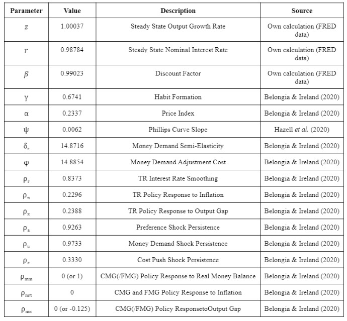
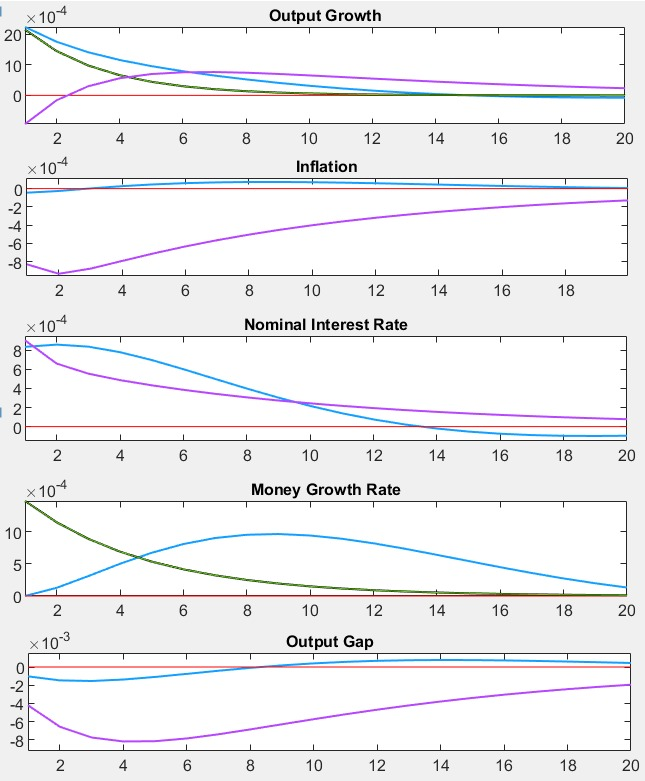
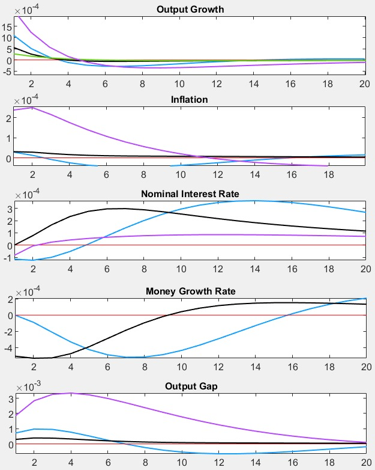
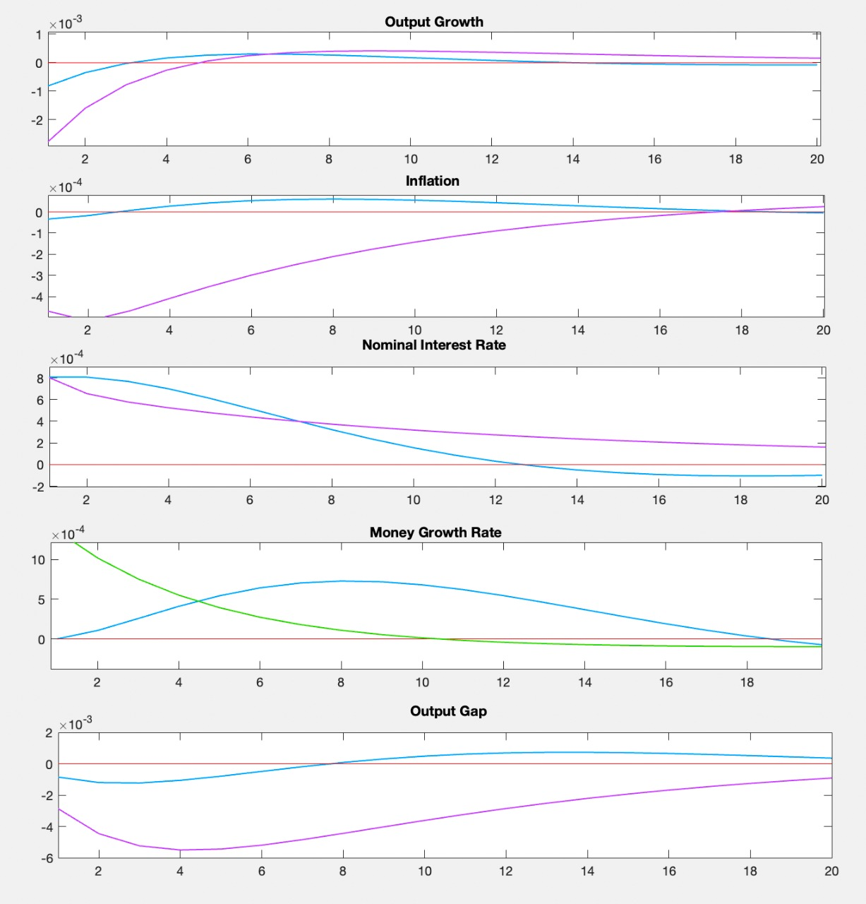
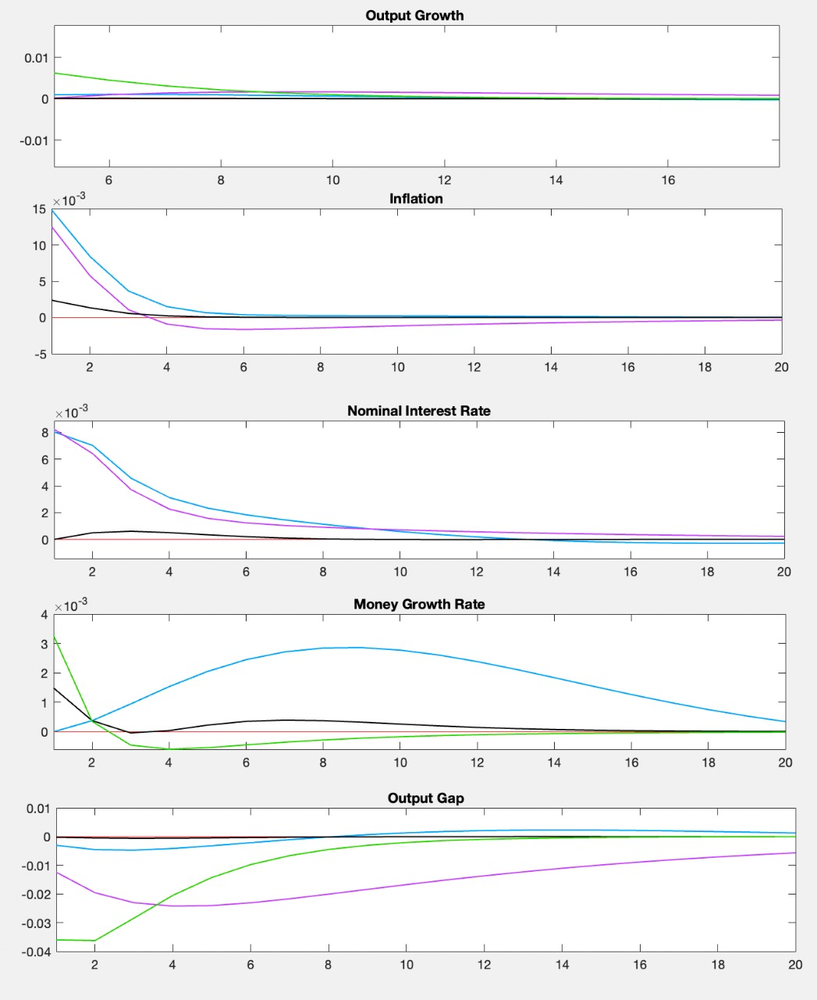

<!-- First: Set your default preferences for chunk options: -->

<!-- If you want a chunk's code to be printed, set echo = TRUE. message = FALSE stops R printing ugly package loading details in your final paper too. I also suggest setting warning = FALSE and checking for warnings in R, else you might find ugly warnings in your paper. -->

```{r setup, include=FALSE}
knitr::opts_chunk$set(echo = FALSE, message = FALSE, warning = FALSE, fig.width = 6, fig.height = 5, fig.pos="H", fig.pos = 'H')
# Note: Include = FALSE implies the code is executed, but not printed in your pdf.
# warning and message = FALSE implies ugly messages and warnings are removed from your pdf.
# These should be picked up when you execute the command chunks (code sections below) in your rmd, not printed in your paper!

# Lets load in example data, and see how this can be stored and later called from your 'data' folder.
if(!require("tidyverse")) install.packages("tidyverse")
library(tidyverse)
#Example_data <- Texevier::Ex_Dat

# Notice that as you are working in a .Rproj file (I am assuming you are) - the relative paths of your directories start at your specified root.
# This means that when working in a .Rproj file, you never need to use getwd() - it is assumed as your base root automatically.
#write_rds(Example_data, path = "data/Example_data.rds")

```

\newpage

# Introduction

According to Belongia and Ireland (2020), nominal interest rate
management has been the Federal Reserve's approach to stabilise the
output gap and inflation. The Taylor rule is a good predictor of the
nominal interest rate management. Interest rate management has been
endorsed by literature and has shown advantages over the management of
money stock, however, economists have only argued against a constant
monetary growth rule but have neglected the potential benefits of a
flexible monetary growth rule. Belongia and Ireland (2020) is a reconsideration of money growth rules in an
estimated New Keynesian model. This paper provides a replication of the New Keynesian model by
Belongia and Ireland (2020) as well as extending the authors' work via calibration, as opposed to estimation. This paper examines the responses of macroeconomic variables under the Taylor rule, Interest Rate rule, Flexible Money Growth rate rule as well as the Constant Money Growth rate rule, in response to the different shocks. The shocks are a preference shock, a productivity shock, a money demand shock and a cost push shock. The macroeconomic variables focused on are output growth rates, inflation, nominal interest rates, money growth rates and output gap.

In section 2, the model is explained. The first order conditions and the log-linearisations of the model are then
presented in sections 3 and 4, respectively. Section 5 provides an explanation of the data and calibration methods used. The paper presents and discusses the calibration results, in the form of impulse response functions in section 6. Lastly, this paper concludes by ...  

# The Model

The model economy from Belongia and Ireland (2020) includes the representative household, a representative finished goods-producing firm, "i" intermediate goods-producing firms (such that $i \in [0; 1]$, is a continuum) and a central bank. For each period, a unique intermediate good is produced by each intermediate goods-producing firm $i$, such that the intermediate goods adopt the same indexing notation, $i \in [0; 1]$. The symmetry of this model suggests that the focus can be narrowed to a representative intermediate goods-producing firm instead. This representative firm then produces good intermediate good $i$.

The household preferences are described by their expected utility function. These preferences, along with the incomplete indexation of sticky nominal goods prices that are determined by the monopolistically competitive intermediate goods-producing firms suggests a New Keynesian IS and Phillips Curve that are both forward, and backwards-looking.
Monetary Policy is assumed to follow a version of the Taylor (1993) rule, in line with the Federal Reserve behaviour over the sample period from 1983 to 2019. To allow for alternative monetary policy rules, the money demand curve used in the paper is chosen such that it may be consistent with US data ranging over the same sample period.
With the basic model set up in this way, the derivations of the model's first order conditions for each representative is replicated in the following sections, followed by the complete system of linearised equations.

# Derivations of Model's First Order Conditions:

## The Representative Household

Each period $t=0,1,2,...$ is entered by the representative household with
$M_{t-1}$ units of money and $B_{t-1}$ bonds. The household receives a lump-sum monetary transfer $T_{t}$ from
the central bank at the beginning of period
$t$. In addition, the household's bonds mature, yielding
$B_{t-1}$ additional units of money. The household uses some of this
money to purchase $B_{t}$ new bonds at the price of $1=rt$ units of
money per bond. Therefore, $r_t$ represents the gross nominal interest rate
between $t$ and $t + 1$. The household provides
$h_{t}{(i)}$ units of labour to each intermediate goods-producing firm
$i\in{[0; 1]}$ during period $t$. The household is paid at the nominal wage rate
$W_{t}$. Households therefore earn $W_{t}h_{t}$ in labour income, where

$$h_{t}=\int h_{t}{(i)} \;di$$

represents the total hours worked during the period. In period $t$,
the household consumes $C_{t}$ units of the finished goods. Finished goods are purchased at
the nominal price, $P_{t}$ from the representative finished
goods-producing firm. The household receives
nominal profits $D_{t}(i)$ from each intermediate goods-producing firm
$i \in {[0; 1]}$, at the end of period $t$. The household then carries $M_{t}$ units of money into
period $t + 1$, which is subject to the following budget constraint:

$$\frac{M_{t-1}+T_{t}+B_{t-1}+W_{t}h_{t}+D_{t}}{P_{t}} \ge C_{t} + \frac{M_{t} + \frac{B_{t}}{r_{t}}}{P_{t}}$$

for all $t=0,1,2,...,$ where

$$D_{t}= \int_{0}^{1}D_{t}{(i)}\;di$$

represents total profits received for the period. The household's
preferences are described by the following expected utility function:

$$E_{0}\sum_{t=0}^{\infty}\beta^{t}a_{t}[ln(C_{t} - \gamma C_{t-1}) + v(\frac{M_{t}}{P_{t}Z_{t}}, u_t)-(\frac{\phi_m}{2})(\frac{M_t/P_t}{zM_{t-1}/P_{t-1}}-1)^{2}(\frac{M_{t}}{P_{t}Z_{t}})-h_{t}]$$

Both the discount factor and the habit formation parameter lie
between zero and one, with $0<\beta<1$ and $0 \ge \gamma \le1$. The
preference shock $a_{t}$ follows the stationary autoregressive process below:

$$\ln(a_{t})=\rho_{a} \ln(a_{t-1}) + \varepsilon_{at} \tag{2}$$

for all $t=0,1,2,...,$ with $0 \le \rho_{a} \le 1$, where the serially
uncorrelated innovation $\varepsilon_{at}$ is normally distributed with a
mean of zero and standard deviation $\sigma_{a}$. Total utility is a combination of the utility obtained from consumption, real balances, and hours worked, which implies additive seperability, so as to
imply a specification for the model's IS curve that does not include
terms involving money and employment. As shown by King, Plosser, and
Rebelo (1988), additive separability also implies that a logarithmic
specification over consumption is necessary for the model to be consistent
with balanced growth. Also for balanced growth, real balances
$M_{t}=P_{t}$ enter utility through the function $v$ after being scaled
by the aggregate productivity shock $Z_{t}$. This follows a random walk
with drift:

$$\ln(Z_{t})= \ln{z} + \ln(Z_{t-1}) + \varepsilon_{zt} \tag{3}$$

where the serially uncorrelated error term or innovation is normally
distributed with zero mean and standard deviation $\sigma_{z}$. The
shock $u_{t}$ to money demand follows the stationary autoregressive
process:

$$\ln(u_{t})= \rho_{u} \ln(u_{t-1}) + \varepsilon_{ut} \tag{4}$$ for all
$t=0,1,2,...$ with $0 \le \rho_{u} <1$, where the serially uncorrelated
innovation $\varepsilon_{ut}$ is normally distributed with mean zero and
standard deviation $\sigma_{u}$. Finally, the parameter $\phi_{m} \ge 0$
governs the magnitude of the adjustment cost for real balances, adapted
from Nelson (2002) and Andres, Lopez-Salido, and Nelson (2004, 2009) to
take the quadratic functional form used here. Since these costs subtract
from utility along with hours worked, they have the interpretation as a
time cost, and are scaled by the average growth rate parameter $z$ from
(3) so as to equal zero in the model's steady state. Thus, the household
chooses $Ct, ht, Bt$, and $Mt$ for all $t = 0, 1, 2,...,$ to maximize
expected utility subject to the budget constraint (1) for all
$t = 0,1,2,...,$

The Household preferences are characterised by the following expected
utility function:

$$ EU(\cdot_t) = E_{0} \sum_{t=0}^\infty \beta^ta_t U(\cdot_t) = E_{0} \sum_{t=0}^\infty \beta^ta_t[\ln(C_{t}-\gamma C_{t-1})+v(\frac{M_t}{P_tZ_t},u_t)-\frac{\phi_m}{2}(\frac{\frac{M_t}{P_t}}{\frac{zM_{t-1}}{P_{t-1}}}-1)^2(\frac{M_t}{P_tZ_t})-h_t]$$

Given the Household budget constraint:

$$ \left[ \frac{M_{t-1} + T_t +B_{t-1} + W_th_t+D_t}{P_t} \ge C_t + \frac{M_t+\frac{B_t}{r_t}}{P_t} \right]$$

Combining the expected utility and budget constraint above, we can write
the LaGrangian for the Household:

$$  \mathcal{L}(\cdot_t) = a_tU( \cdot_{t}) + \beta E_t \mathcal{L}(\cdot_{t+1}) + \Lambda_t \left[ \frac{M_{t-1} + T_t +B_{t-1} + W_th_t+D_t}{P_t}-C_t - \left(\frac{M_t+\frac{B_t}{r_t}}{P_t} \right) \right] $$

where:

$$\begin{aligned} \mathcal{L}(\cdot_{t}) = \mathcal{L}(C_t, h_t, B_t, M_t) = &E_{0} \sum_{t=0}^\infty \beta^ta_t \left[\ln(C_{t}-\gamma C_{t-1})+v(\frac{M_t}{P_tZ_t},u_t)-\frac{\phi_m}{2}(\frac{\frac{M_t}{P_t}}{\frac{zM_{t-1}}{P_{t-1}}}-1)^2(\frac{M_t}{P_tZ_t})-h_t \right]\\
& + E_{0} \sum_{t=0}^\infty\left[ \Lambda_t \left( \frac{M_{t-1} + T_t +B_{t-1} + W_th_t+D_t}{P_t}-C_t - \left(\frac{M_t+\frac{B_t}{r_t}}{P_t} \right) \right) \right] \end{aligned}$$

<!-- $$+ E_0 \sum_{t=0}^\infty \Lambda_t[\frac{M_{t-1} + T_t +B_{t-1} + W_th_t+D_t}{P_t}-C_t- (\frac{M_t+\frac{B_t}{r_t}}{P_t})]$$ -->

### The FOC with respect to $C_t$:

$$\frac{\partial \mathcal{L}(C_t, h_t, B_t, M_t)}{\partial C_t}= a_t(\frac{1}{C_t-\gamma C_{t-1}})-\Lambda_t + E_t\beta a_{t+1}(-\gamma)(\frac{1}{C_{t+1}-\gamma C_t})$$

Equate to zero and solve:

$$0=  a_t(\frac{1}{C_t-\gamma C_{t-1}})-\Lambda_t + E_t\beta a_{t+1}(-\gamma)(\frac{1}{C_{t+1}-\gamma C_t})$$

$$\Lambda_t =  a_t(\frac{1}{C_t-\gamma C_{t-1}}) + E_t\beta a_{t+1}(-\gamma)(\frac{1}{C_{t+1}-\gamma C_t}) \tag{5}$$

### The FOC with respect to $h_t$:

$$\frac{\partial \mathcal{L}(C_t, h_t, B_t, M_t)}{\partial h_t}= (-1)( a_t) + (\frac{W_t}{P_t})(\Lambda_t)$$

Equate to zero and solve:

$$0 = (-1)( a_t) + (\frac{W_t}{P_t})(\Lambda_t)$$
$$( a_t) = (\frac{W_t}{P_t})(\Lambda_t) $$
$$ a_t = (\frac{W_t}{P_t})(\Lambda_t) \tag{6}$$

### The FOC with respect to $B_t$:

$$\frac{\partial L(C_t, h_t, B_t, M_t)}{\partial B_t}= (\frac{-1}{r_t P_t})(\Lambda_t) + E_t\beta \Lambda_{t+1}(\frac{1}{P_{t+1}})$$

Equate to zero and solve:

$$ 0=(\frac{-1}{r_t P_t})(\Lambda_t) + E_t\beta \Lambda_{t+1}(\frac{1}{P_{t+1}})$$
$$ (\frac{1}{r_t P_t})(\Lambda_t) = E_t\beta \Lambda_{t+1}(\frac{1}{P_{t+1}})$$
$$ \Lambda_t = (r_t P_t) E_t\beta\Lambda_{t+1}(\frac{1}{P_{t+1}})$$
$$ \Lambda_t = \beta(r_t) E_t(\frac{P_t\Lambda_{t+1}}{P_{t+1}})$$

Because: $$\pi_t=\frac{P_t}{P_{t-1}}$$

Therefore: $$\frac{P_t}{P_{t+1}}=\frac{1}{\pi_{t+1}}$$

As such, the equation can be rewritten as:

$$\Lambda_t = \beta(r_t)E_t(\frac{\Lambda_{t+1}}{\pi_{t+1}}) \tag{7}$$

### The FOC with respect to $M_t$:

$$\frac{\partial L(C_t, h_t, B_t, M_t)}{\partial M_t}=a_t[v_1(\frac{M_t}{P_tZ_t}, u_t) \frac{1}{P_t Z_t}-\phi_m(\frac{\frac{M_t}{P_t}}{\frac{z_tM_{t-1}}{P_{t-1}}}-1)(\frac{\frac{1}{P_{t}}}{\frac{ZM_{t-1}}{P_{t-1}}})(\frac{M_t}{P_tZ_t})-\frac{\phi_m}{2}(\frac{\frac{M_t}{P_t}}{\frac{z_tM_{t-1}}{P_{t-1}}}-1)^2(\frac{1}{P_tZ_t})]$$
$$ + \Lambda_t[-\frac{1}{P_t}] + E_t\beta a_{t+1} \left[-\phi_m(\frac{M_{t+1}/P_{t+1}}{ZM_t/P_t}-1)(-\frac{M_{t+1}/P_{t+1}}{zM_{t}^2/P_{t}})(\frac{M_{t+1}}{P_{t+1}Z_{t+1}}) \right]+E_t \beta \Lambda_{t+1}(\frac{1}{P_{t+1}})$$

where:

$$ v_1(\cdot) = \frac{\partial}{\partial M_t} v(\cdot) $$

We can now use equation (7) and the fact that
$\frac{P_t}{P_{t-1}} = \pi_t$, to yield:

$$ \beta E_t \Lambda_{t+1} \frac{1}{P_{t+1}} = \frac{1}{P_tr_t} \Lambda_t $$

multiply by $\frac{1} {P_t Z_t}$ throughout and set equal to zero:

$$\begin{aligned} \therefore 0 = & a_tv_1(\frac{M_t}{P_tZ_t}, u_t) - a_t\frac{\phi_m}{2}(\frac{\frac{M_t}{P_t}}{\frac{zM_{t-1}}{P_{t-1}}}-1)^2 -  a_t \phi_m(\frac{\frac{M_t}{P_t}}{\frac{zM_{t-1}}{P_{t-1}}}-1)(\frac{\frac{M_t}{P_{t}}}{\frac{zM_{t-1}}{P_{t-1}}})\\
& - \Lambda_t Z_t + \frac{Z_t}{r_t} \Lambda_t + E_t\beta a_{t+1} \left[\phi_m(\frac{M_{t+1}/P_{t+1}}{ZM_t/P_t}-1) \left(\frac{M_{t+1}/P_{t+1}}{zM_{t}/P_{t}} \right)^2(\frac{zZ_t}{Z_{t+1}}) \right] \end{aligned}$$

Rearranging yields the final result:

$$\begin{aligned}
&a_{t} v_{1}\left(\frac{M_{t}}{P_{t} Z_{t}}, u_{t}\right)-a_{t}\left(\frac{\phi_{m}}{2}\right)\left(\frac{M_{t} / P_{t}}{z M_{t-1} / P_{t-1}}-1\right)^{2} \\
&-a_{t} \phi_{m}\left(\frac{M_{t} / P_{t}}{z M_{t-1} / P_{t-1}}-1\right)\left(\frac{M_{t} / P_{t}}{z M_{t-1} / P_{t-1}}\right) \\
&+\beta \phi_{m} E_{t}\left[a_{t+1}\left(\frac{M_{t+1} / P_{t+1}}{z M_{t} / P_{t}}-1\right)\left(\frac{M_{t+1} / P_{t+1}}{z M_{t} / P_{t}}\right)^{2}\left(\frac{z Z_{t}}{Z_{t+1}}\right)\right] \\
&=Z_{t} \Lambda_{t}\left(1-\frac{1}{r_{t}}\right)
\end{aligned} \tag{8}$$

Using the fact that:

$$v_1(\frac{M_t}{P_tZ_t},u_t) = \frac{1}{\delta}[\ln(m*) - \ln(\frac{M_t}{P_tZ_t}) + \ln(u_t)]$$

We can rewrite (8) to yield:

$$\begin{array}{l}
\frac{a_{t}}{\delta}\left[\ln \left(m^{*}\right)-\ln \left(\frac{M_{t}}{P_{t} Z_{t}}\right)+\ln \left(u_{t}\right)\right]-a_{t}\left(\frac{\phi_{m}}{2}\right)\left(\frac{M_{t} / P_{t}}{z M_{t-1} / P_{t-1}}-1\right)^{2} \\
-a_{t} \phi_{m}\left(\frac{M_{t} / P_{t}}{z M_{t-1} / P_{t-1}}-1\right)\left(\frac{M_{t} / P_{t}}{z M_{t-1} / P_{t-1}}\right) \\
+\beta \phi_{m} E_{t}\left[a_{t+1}\left(\frac{M_{t+1} / P_{t+1}}{z M_{t} / P_{t}}-1\right)\left(\frac{M_{t+1} / P_{t+1}}{z M_{t} / P_{t}}\right)^{2}\left(\frac{z Z_{t}}{Z_{t+1}}\right)\right] \\
=Z_{t} \Lambda_{t}\left(1-\frac{1}{r_{t}}\right)
\end{array} \tag{9}$$

## The Representative Finished Goods-Producing Firm

The representative finished goods-producing firm uses $Y_t(i)$ units of
each intermediate good $i \in [0,1]$. These intermediate goods are
bought at the nominal price $P_t(i)$ to produce $Y_t$ units of
the final good according to the technology described by

$$[\int_0^1Y_t(i)^{\frac{(\theta_t-1)}{\theta_t}} di]^{\frac{\theta_t}{\theta_t-1}} \ge Y_t$$

Here, $\theta_t$ represents a random shock to the intermediate
goods-producing firms' preferred markup of price over marginal cost. It acts like a cost push shock of the kind introduced into the New Keynesian model by Clarida, Gali & Gertler (1999). This
markup shock follows the stationary autoregressive process

$$\ln(\theta_t)=(1-\rho_{\theta})\ln(\theta)+\rho_{\theta}\ln(\theta_{t-1})+\varepsilon_{\theta t} \tag{10}$$

for all $t=0,1,2,...,$, where the serially uncorrelated innovation
$\varepsilon_{\theta t}$ follows a normal distribution with a mean of zero and a
standard deviation $\sigma_{\theta}$. Therefore, in each period $t$, the
finished good-producing firm chooses $Y_t(i)$ for all $i \in [0,1]$ to
maximize its profits, which are given by

$$P_t[\int_0^1Y_t(i)^{\frac{\theta_t-1}{\theta_t}} di]^{\frac{\theta_t}{\theta_t-1}} - \int_0^1P_t(i)Y_t(i) \;di$$

The first order conditions are derived from the following Langrangian function:

$$L = \int_0^1P_t(i)Y_t(i) \; di +\lambda_t[Y_t - (\int_0^1Y_t(i)^{\frac{\theta_t-1}{\theta_t}} \;di)^{\frac{\theta_t}{\theta_t-1}}]$$

### The FOC with respect to $Y_t(i)$:

$$\frac{\partial L}{\partial Y_t(i)} = P_t(i) - \lambda_t[{\frac{\theta_t}{\theta_t-1}} (\int_0^1 Y_t(i)^{\frac{\theta_t-1}{\theta_t}} di)^{\frac{\theta_t}{\theta_t-1} -1} \frac{\theta_t-1}{\theta_t} Y_t(i)^{\frac{\theta_t-1}{\theta_t} -1}] = 0$$
$$P_t(i) - \lambda_t[{\frac{\theta_t}{\theta_t-1}} (\int_0^1 Y_t(i)^{\frac{\theta_t-1}{\theta_t}} di)^{\frac{1}{\theta_t-1}} \frac{\theta_t-1}{\theta_t} Y_t(i)^{\frac{-1}{\theta_t}}] = 0$$

$$ \lambda_t[\int_0^1 Y_t(i)^{\frac{\theta_t-1}{\theta_t}} di]^{\frac{1}{\theta_t-1}} Y_t(i)^{\frac{-1}{\theta_t}} = P_t(i)$$

$$ \lambda_t[\int_0^1 Y_t(i)^{\frac{\theta_t-1}{\theta_t}} di]^{\frac{1}{\theta_t-1}}  = P_t(i)Y_t(i)^{\frac{1}{\theta_t}}$$
$$ \lambda_t[\int_0^1 Y_t(i)^{\frac{\theta_t-1}{\theta_t}} di]^{\frac{1}{\theta_t-1}}P_t(i)^{-1}  = Y_t(i)^{\frac{1}{\theta_t}}$$

$$ \lambda_t^{\theta_t} [\int_0^1 Y_t(i)^{\frac{\theta_t-1}{\theta_t}} di]^{\frac{\theta_t}{\theta_t-1}}P_t(i)^{-\theta_t}  = Y_t(i)$$

$$ \lambda_t^{\theta_t} Y_t P_t(i)^{-\theta_t} = Y_t(i)$$ Where
$Y_t = [\int_0^1 Y_t(i)^{\frac{\theta_t-1}{\theta_t}} di]^{\frac{\theta_t}{\theta_t-1}}$

$$ (\frac{\lambda_t}{P_t(i)})^{\theta_t} Y_t  = Y_t(i)$$ Sub
$Y_t(i) = (\frac{\lambda_t}{P_t(i)})^{\theta_t} Y_t$ into $Y_t$

$$[\int_0^1 ((\frac{\lambda_t}{P_t(i)})^{\theta_t} Y_t)^{\frac{\theta_t-1}{\theta_t}} di]^{\frac{\theta_t}{\theta_t-1}}  = Y_t$$
$$[\int_0^1 ((\frac{P_t(i)}{\lambda_t})^{-\theta_t})^{\frac{\theta_t-1}{\theta_t}} di]^{\frac{\theta_t}{\theta_t-1}}  = 1$$
$$(\frac{1}{\lambda_t})^{-\theta_t}[\int_0^1 (P_t(i))^{-\theta_t+1} di]^{\frac{\theta_t}{\theta_t-1}}  = 1$$

$$[\int_0^1 (P_t(i))^{1-\theta_t} di]^{\frac{\theta_t}{\theta_t-1}}  = {\lambda_t}^{-\theta_t}$$
$$[\int_0^1 (P_t(i))^{1-\theta_t} di]^{\frac{1}{1-\theta_t}}  = {\lambda_t}$$
Therefore:

$$\lambda_t = P_t$$ Sub $Y_t = P_t$ back in:

$$(\frac{P_t}{P_t(i)})^{\theta_t} Y_t = Y_t(i)$$

Therefore:

$$Y_t(i) = (\frac{P_t(i)}{P_t})^{-\theta_t} Y_t$$

## The Representative Intermediate Goods-Producing Firm

In each period $t=0,1,2,...,$ the representative intermediate
goods-producing firm uses $h_t(i)$ units of labour from the
representative household to produce $Y_t(i)$ units of intermediate
good $i$ according to the technology described by:

$$Z_th_t(i) \ge Y_t(i) \tag{11}$$

Here, $Z_t$ represents the aggregate productivity shock introduced in (3).

In order to change its nominal price between periods, the firm undergoes a quadratic cost of adjustment, given by:

$$\frac{\phi_p}{2}[\frac{P_t(i)}{{\pi_{t-1}^a \pi^{1-a}P_{t-1}(i)}}-1]^2Y_t$$

In order to maximise its total real market value proportional to:

$$E_0\sum_{t=0}^\infty \beta^t\Lambda_t[\frac{D_t(i)}{P_t}]$$
the firm chooses $P_t(i)$ for all $t = 0,1,2,...$.

Here, the firm's real profits are measured by:

$$\frac{D_t(i)}{P_t}=[\frac{P_t(i)}{P_t}]^{1-\theta_t}Y_t-[\frac{P_t(i)}{P_t}]^{-\theta_t}(\frac{W_t}{P_t})(\frac{Y_t}{Z_t})-\frac{\phi}{2}[\frac{P_t(i)}{\pi_{t-1}^a \pi^{1-a}P_{t-1}(i)}]^2Y_t\tag{12}$$

The Value Function of this optimisation problem is:
$$v=maxE_t\sum_{t=0}^\infty\beta^t\Lambda_t{\frac{D_t(i)}{P_t}}$$

From this, the Bellm
an Equation can be constructed as:

$$v=\beta^t\Lambda_t{\frac{D_t(i)}{P_t}} + \beta^{t+1}E_t\Lambda_{t+1}{\frac{D_{t+1}(i)}{P_{t+1}}}$$
$$v=\beta^t\Lambda_t[(\frac{P_t(i)}{P_t})^{1-\theta_t}Y_t-(\frac{P_t(i)}{P_t})^{-\theta_t}(\frac{W_t}{P_t})(\frac{Y_t}{Z_t})-\frac{\phi}{2}(\frac{P_t(i)}{\pi_{t-1}^a \pi^{1-a}P_{t-1}(i)})^2Y_t] + \beta^{t+1}E_t\Lambda_{t+1}[(\frac{P_{t+1}(i)}{P_{t+1}})^{1-\theta_{t+1}}Y_{t+1}$$

$$-(\frac{P_{t+1}(i)}{P_{t+1}}]^{-\theta_{t+1}}(\frac{W_{t+1}}{P_{t+1}})(\frac{Y_{t+1}}{Z_{t+1}})-\frac{\phi_p}{2}[\frac{P_{t+1}(i)}{\pi_{t}^a \pi^{1-a}P_{t}(i)}]^2Y_{t+1}]$$

### The FOC with respect to $P_t(i)$

$$ \frac{\partial v}{\partial P_t(i)} = \beta^t\Lambda_t(1-\theta_t)(\frac{P_t(i)}{P_t})^{-\theta_t}(\frac{1}{P_t})Y_t-\beta^t\Lambda_t[(-\theta_t\frac{P_t(i)}{P_t})^{-\theta_t-1}(\frac{1}{P_t})(\frac{W_t}{P_t})(\frac{Y_t}{Z_t})]$$
$$-\beta^t\Lambda_t[\phi_p(\frac{P_t(i)}{\pi_{t-1}^a \pi^{1-a}P_{t-1}(i)}-1)(\frac{1}{\pi_{t-1}^a \pi^{1-a}P_{t-1}(i)})Y_t] -\beta^{t+1}E_t\Lambda_{t+1}\phi_p[(\frac{P_{t+1}(i)}{\pi_t^a\pi^{1-a}P_{t}(i)}-1)(\frac{-P_{t+1}(i)Y_{t+1}}{\pi_t^a\pi^{1-a}P_{t}(i)^2})] =0$$

Next, in order to cancel out most $\Lambda_t$, $Y_t$ and $P_t$'s,
multiply through by $\frac{P_t}{\Lambda_t Y_t}$:

$$\beta^t(1-\theta_t)(\frac{P_t(i)}{P_t})^{-\theta_t} + \beta^t[\theta_t(\frac{P_t(i)}{P_t})^{-\theta_t-1}(\frac{W_t}{P_t})(\frac{1}{Z_t})] - \beta^t\phi_p[(\frac{P_t(i)}{\pi_{t-1}^a \pi^{1-a}P_{t-1}(i)}-1)(\frac{P_t}{\pi_{t-1}^a \pi^{1-a}P_{t-1}(i)})]$$
$$  +\beta^{t+1}\phi_pE_t(\frac{\Lambda_{t+1}}{\Lambda_{t}})(\frac{P_{t+1}(i)}{\pi_t^a\pi^{1-a}P_{t}(i)}-1)(\frac{P_{t+1}(i)}{\pi_t^a\pi^{1-a}P_{t}(i)})(\frac{Y_{t+1}}{Y_t})(\frac{P_t}{P_t(i)})=0$$

$$(1-\theta_t)(\frac{P_t(i)}{P_t})^{-\theta_t} + \theta_t(\frac{P_t(i)}{P_t})^{-\theta_t-1}(\frac{W_t}{P_t})(\frac{1}{Z_t}) - \phi_p[(\frac{P_t(i)}{\pi_{t-1}^a \pi^{1-a}P_{t-1}(i)}-1)(\frac{P_t}{\pi_{t-1}^a \pi^{1-a}P_{t-1}(i)})]$$
$$ + \beta\phi_pE_t(\frac{\Lambda_{t+1}}{\Lambda_{t}})(\frac{P_{t+1}(i)}{\pi_t^a\pi^{1-a}P_{t}(i)}-1)(\frac{P_{t+1}(i)}{\pi_t^a\pi^{1-a}P_{t}(i)})(\frac{Y_{t+1}}{Y_t})(\frac{P_t}{P_t(i)})=0 \tag{13}$$

and (11) with equality for all $t=0,1,2,...,$

## The Efficient Level of Output and Output Gap

A social planner for this economy who can overcome the frictions
associated with monetary trade, sluggish price adjustment, and the
monopolistically competitive structure of the intermediate
goods-producing sector chooses $Q_t$ and $n_t(i)$ for all $i \in [0,1]$
to maximize the social welfare function

$$E_0\sum_{t=0}^{\infty}\beta^ta_t[\ln(Q_t-\gamma Q_{t-1})-\int_0^1n_t(i) di]$$
subject to

$$Z_t[\int_0^1n_t(i) di]^{\frac{\theta_t}{\theta_t-1}} \ge Q_t$$ As
such, the Bellman Equation of this model is:

$$v(Q_{t-1}) = a_t[\ln(Q_t-\gamma Q_{t-1})-\int_0^1n_t(i) di] + \beta E_tv(Q_t,Q_{t+1}) + \Xi [Z_t(\int_0^1n_t(i) di)^{\frac{\theta_t}{\theta_t-1}} - Q_t]$$

### The FOC with respect to $Q_t$:

$$\frac{\partial v(Q_{t-1})}{\partial Q_t} = \frac{a_t}{Q_t-\gamma Q_{t-1}} + \beta E_t\frac{\partial v(Q_t, Q_{t+1})}{\partial Q_t} - \Xi =0$$
We know that

$$\frac{\partial v(Q_{t-1})}{\partial Q_{t-1}} = \frac{a_t}{Q_t-\gamma Q_{t-1}} (-\gamma)$$

Therefore, when iterating forward, we find that:
$$\frac{\partial v(Q_{t})}{\partial Q_{t}} = \frac{a_{t+1}}{Q_{t+1}-\gamma Q_{t}} (-\gamma)$$

Subbing $\frac{\partial v(Q_{t})}{\partial Q_{t}}$ back in gives:

$$\frac{\partial v(Q_{t-1})}{\partial Q_t} = \frac{a_t}{Q_t-\gamma Q_{t-1}} + \beta E_t\frac{a_{t+1}}{Q_{t+1}-\gamma Q_{t}} (-\gamma) - \Xi =0$$
Multiply through by $(-1)$:

$$ \frac{a_t}{Q_t-\gamma Q_{t-1}} - \beta E_t\frac{a_{t+1}}{Q_{t+1}-\gamma Q_{t}} (\gamma)  = \Xi$$

### The FOC with respect to $n_t$:

$$\frac{\partial v(Q_{t-1})}{\partial n_t} = a_t (-1) + \Xi Z_t \frac{\theta_t}{\theta_t -1} (\int_0^1n_t(i)^\frac{\theta_t -1}{\theta_t} di)^\frac{\theta_t}{\theta_t - 1} (\frac{\theta_t -1}{\theta_t}) n_t(i)^{\frac{\theta_t -1}{\theta_t}-1}=0$$
$$ a_t + \Xi Z_t  (\int_0^1n_t(i)^\frac{\theta_t -1}{\theta_t} di)^\frac{1}{\theta_t - 1} n_t(i)^{\frac{-1}{\theta_t}}=0$$
$$  \Xi Z_t  (\int_0^1n_t(i)^\frac{\theta_t -1}{\theta_t} di)^\frac{1}{\theta_t - 1} n_t(i)^{\frac{-1}{\theta_t}}=a_t$$

The Feasibility Constraint of this problem is:
$$(\int_0^1n_t(i)^\frac{\theta_t -1}{\theta_t} di)^\frac{\theta_t}{\theta_t - 1} \ge \frac{Q_t}{Z_t}$$
Rearranging the Feasibility Constraint gives:

$$(\int_0^1n_t(i)^\frac{\theta_t -1}{\theta_t} di)^\frac{1}{\theta_t - 1} \ge (\frac{Q_t}{Z_t})^\frac{1}{\theta_t}$$
Therefore

$$\Xi Z_t (\frac{Q_t}{Z_t})^\frac{1}{\theta_t}n_t(i)^{\frac{-1}{\theta_t}}=a_t$$

\newpage

# Log-Linearisation:

## Obtaining the final system of equations:

### Conditions:

To rewrite the equations into a usable system of equations that can be
log-linearised, we make use of the following series of steady state,
stationary or equilibrium equations and variables:

#### A:

$$ Y_{t}(i)=Y_{t}, h_{t}(i)=h_{t}, D_{t}(i)=D_{t}, \text { and } P_{t}(i)=P_{t} \text { for all } i \in[0,1] \text { and } t=0,1,2, \ldots $$

#### B:

$$ M_{t}=M_{t-1}+T_{t} \text { and } B_{t}=B_{t-1}=0 $$

#### C:

$$ y_{t}=Y_{t} / Z_{t}, c_{t}=C_{t} / Z_{t}, m_{t}=\left(M_{t} / P_{t}\right) / Z_{t}, q_{t}=Q_{t} / Z_{t}, \lambda_{t}=Z_{t} \Lambda_{t}, \text { and } z_{t}=Z_{t} / Z_{t-1} $$

#### D:

In steady state we can write the following, per their definitions:

$$\begin{aligned} & y_{t}=y,\ c_{t}=c,\ \pi_{t}=\pi,\ r_{t}=r, \ m_{t}=m,\ q_{t}=q,\ x_{t}=x,\ \\ 
& \mu_{t}=\mu,\ g_{t}=g,\ \lambda_{t}=\lambda,\ a_{t}=a=1,\ z_{t}=z,\ u_{t}=u=1, \\ 
& \text {and } \theta_{t}=\theta \end{aligned}$$

### Imposing The Coniditions:

Firstly, we combine equation (11) and (12) from Section 3.3 [The
Representative Intermediate Goods-Producing Firm] and impose the above
conditions to obtain equation (1) from the appendix of "Belongia and Ireland (2020)":

$$Y_{t} = C_t + \frac{\phi_{p}}{2} \cdot \left[ \frac{\pi_{t}}{{\pi_{t-1}}^{\alpha} \pi^{1-\alpha}} -1 \right]^{2} \cdot Y_t $$

Dividing both sides by $Z_t$ we can substitute for the necessary
stationarity variables and rewrite as:

$$y_{t}=c_{t}+\frac{\phi_{p}}{2}\left(\frac{\pi_{t}}{\pi_{t-1}^{\alpha} \pi^{1-\alpha}}-1\right)^{2} y_{t} \tag{1}$$

Directly from Equations (2)-(4) in Section 3.1 [The Representative
Household]:

$$\ln \left(a_{t}\right)=\rho_{a} \ln \left(a_{t-1}\right)+\varepsilon_{a t} \tag{2}$$

$$\ln \left(Z_{t}\right)=\ln (z) + \ln(Z_{t-1}) +\varepsilon_{z t}$$

Subtract both sides by $\ln(Z_{t-1})$

$$\ln \left(z_{t}\right)=\ln (z)+\varepsilon_{z t} \tag{3}$$

$$\ln \left(u_{t}\right)=\rho_{u} \ln \left(u_{t-1}\right)+\varepsilon_{u t} \tag{4} $$

From [The FOC with respect to $C_t$:]

$$ \Lambda_t = \frac{a_t}{C_t-\gamma C_{t-1}} - \beta \gamma E_t \left[ \frac{a_{t+1}}{C_{t+1} - \gamma C_t} \right] $$

$$\Rightarrow \lambda_{t}=\frac{a_{t}z_{t}}{z_{t} c_{t}-\gamma c_{t-1}}-\beta \gamma E_{t}\left(\frac{a_{t+1}}{z_{t+1} c_{t+1}-\gamma c_{t}}\right) \tag{5}$$

$$\lambda_{t}=\beta r_{t} E_{t}\left(\frac{\lambda_{t+1}}{z_{t+1} \pi_{t+1}}\right) \tag{7}$$

Rewrite equation (9) from [The FOC with respect to $M_t$:]

$$\begin{aligned}
&a_{t} v_{1}\left(\frac{M_{t}}{P_{t} Z_{t}}, u_{t}\right)-a_{t}\left(\frac{\phi_{m}}{2}\right)\left(\frac{M_{t} / P_{t}}{z M_{t-1} / P_{t-1}}-1\right)^{2} \\
&-a_{t} \phi_{m}\left(\frac{M_{t} / P_{t}}{z M_{t-1} / P_{t-1}}-1\right)\left(\frac{M_{t} / P_{t}}{z M_{t-1} / P_{t-1}}\right) \\
&+\beta \phi_{m} E_{t}\left[a_{t+1}\left(\frac{M_{t+1} / P_{t+1}}{z M_{t} / P_{t}}-1\right)\left(\frac{M_{t+1} / P_{t+1}}{z M_{t} / P_{t}}\right)^{2}\left(\frac{z Z_{t}}{Z_{t+1}}\right)\right] \\
&=Z_{t} \Lambda_{t}\left(1-\frac{1}{r_{t}}\right)
\end{aligned}$$

$$\begin{aligned} & \frac{a_{t}}{\delta}\left[\ln \left(m^{*}\right)-\ln \left(m_{t}\right)+\ln \left(u_{t}\right)\right]-a_{t}\left(\frac{\phi_{m}}{2}\right)\left(\frac{z_{t} m_{t}}{z m_{t-1}}-1\right)^{2} \\
& -a_{t} \phi_{m}\left(\frac{z_{t} m_{t}}{z m_{t-1}}-1\right)\left(\frac{z_{t} m_{t}}{z m_{t-1}}\right) \\
& +\beta \phi_{m} E_{t}\left[a_{t+1}\left(\frac{z_{t+1} m_{t+1}}{z m_{t}}-1\right)\left(\frac{z_{t+1} m_{t+1}}{z m_{t}}\right)^{2}\left(\frac{z}{z_{t+1}}\right)\right] \\
& =\lambda_{t}\left(1-\frac{1}{r_{t}}\right), \\
\end{aligned}$$

## Applying the Taylor Method of Linear Approximation

We apply the Taylor throughout the following section as follows:

For a function $f(x_t)$ input $x_t$ , we apply the Taylor method such
that: $$f(x_t) = f(X^{SS}) + \frac{df(x)}{x_t} (x_t(i) - x^{SS})$$

Using the approximation: $$\begin{aligned}
&x_t - x^{SS} \approx x^{SS} \hat{x}_{t}
\\
&\text{where } \hat{x}_{t} = \ln(x_t)-\ln(x^{SS})
\\
&\text{For short, we write: } x^{SS} \equiv x
\\
&\text{(i.e. no time subscript)}
\end{aligned}$$

## Uhlig's Method of Linearisation

Applying Uhlig's method requires the following:

\newpage

For the function $f(x_t)$ i.e., we use the fact that:

1.  $$\hat{x}_t = \ln(x_t) - \ln(x) \\
    \text{ where x } \equiv x^{SS}$$

2.  Then, $f(^{SS})$ is used to simplify $f(x_t)$ where $x_t$ is
    replaced accodring to $x_t = x \cdot e^{\hat{x}_t}$

3.  Additionally, the approximation result
    $e^{x_t+y_t} \approx 1+x_t+y_t$ is used for further simplification.

4.  For the last step, all constants can be dropped.

For the following sections, we show the steps to reach the final
log-linearised equations (19) to (31) from in Section 2.7 of "THE
PAPER".

## Equation (1) from the appendix of "Belongia and Ireland (2020)"

Recall the results from equation (11), (12), and the Budget Constraint:

$$Z_th_t(i) \ge Y_t(i) \tag{11}$$
$$\frac{D_t(i)}{P_t}=[\frac{P_t(i)}{P_t}]^{1-\theta_t}Y_t-[\frac{P_t(i)}{P_t}]^{-\theta_t}(\frac{W_t}{P_t})(\frac{Y_t}{Z_t})-\frac{\phi}{2}[\frac{P_t(i)}{\pi_{t-1}^a \pi^{1-a}P_{t-1}(i)}]^2Y_t\tag{12}$$
$$\frac{M_{t-1}+T_{t}+B_{t-1}+W_{t} h_{t}+D_{t}}{P_{t}} \geq C_{t}+\frac{M_{t}+B_{t} / r_{t}}{P_{t}}$$

We can now apply the equilibrium conditions to obtain the results:

$$Z_th_t = Y_t $$
$$\begin{aligned} \frac{D_t}{P_t} & =[\frac{P_t}{P_t}]^{1-\theta_t}Y_t - [\frac{P_t}{P_t}]^{-\theta_t}(\frac{W_t}{P_t})(\frac{Y_t}{Z_t})-\frac{\phi}{2}[\frac{P_t}{\pi_{t-1}^a \pi^{1-a}P_{t-1}}]^2Y_t \\
& = Y_t - (\frac{W_t}{P_t})(\frac{Y_t}{Z_t}) - \frac{\phi}{2}[\frac{P_t}{\pi_{t-1}^a \pi^{1-a}P_{t-1}}]^2Y_t \end{aligned}$$
$$\begin{aligned} C_{t} &= \frac{M_{t-1}+T_{t}+\frac{W_tY_t}{Z_t}+D_{t} - M_{t-1} - T_t}{P_{t}}\\
& = \frac{W_tY_t}{Z_t P_t} + \frac{D_{t}}{P_t}
\end{aligned}$$

$$\begin{aligned} -Y_t  &= -\left[ \frac{D_t}{P_t} + (\frac{W_t}{P_t})(\frac{Y_t}{Z_t}) \right] - \frac{\phi}{2}[\frac{P_t}{\pi_{t-1}^a \pi^{1-a}P_{t-1}}]^2Y_t \\
\therefore Y_t & = C_t - \frac{\phi}{2}[\frac{P_t}{\pi_{t-1}^a \pi^{1-a}P_{t-1}}]^2Y_t
\end{aligned}$$

Finally, we can now rewrite & linearise the final equation:

$$\begin{aligned}
y_{t} &= c_t + \frac{\phi_{p}}{2} \cdot \left[ \frac{\pi_{t}}{{\pi_{t-1}}^{\alpha} \pi^{1-\alpha}} -1 \right]^{2} \cdot y\\
&=c_{t} + \frac{\phi_{p}}{2} \cdot \left(\frac{\pi_{t}}{{\pi_{t-1}}^{\alpha} \pi^{1-\alpha}} \right)^2 \cdot y_{t} - \phi_{p} \cdot
\frac{\pi_{t}}{{\pi_{t-1}}^{\alpha} \pi^{1-\alpha}} \cdot y_{t} + \frac{\phi_{p}}{2} \cdot y_{t}\\
&= c_t + p_{1} - p_{2} + p_{3}
\end{aligned}$$

Now, we apply the Taylor method to each $p_{i}$, to get:

$$\begin{aligned}
p_{1}^{SS}&=\frac{\phi_{p} \cdot y}{2}\\\left[\frac{dp_{1}}{dy_{t}} \right]^{SS} &= \frac{\phi_{p}}{2}\\\left[\frac{dp_{1}}{d\pi_{t}} \right]^{SS} &= \frac{\phi_{p} \cdot y}{\pi}\\\left[\frac{dp_{1}}{d\pi_{t-1}} \right]^{SS} &= - \frac{\phi_{p} \cdot y}{\pi}
\end{aligned}$$

### p1

Therefore, we can rewrite $p_{1}$ using the Taylor method, as:

$$\begin{aligned}
p_{1} = \frac{\phi_{p} \cdot y}{2} + \frac{\phi_{p}}{2} y \cdot \hat{y_{t}} + \frac{\phi_{p} \cdot y}{\pi} \pi \cdot \hat{\pi_{t}} - \frac{\phi_{p} \cdot y}{\pi}\pi \cdot \hat{\pi_{t-1}}\\
= \frac{\phi_{p} \cdot y}{2} + \frac{\phi_{p} \cdot y \cdot \hat{y_{t}} }{2} + \phi_{p} \cdot y \cdot \hat{\pi}_{t} - \alpha \cdot \phi_{p} \cdot y \cdot \hat{\pi}_{t-1} \\
\end{aligned}$$

### p2

and for $p_{2}$

$$\begin{aligned}
\left[ p_{2} \right]^{SS} &= \phi_{p} y
\\
\left[ \frac{dp_{2}}{dy_{t}} \right]^{SS} &= \phi_{p}
\\
\left[ \frac{dp_{2}}{d\pi_{t}} \right]^{SS} &= \frac{\phi_{p} y}{\pi}
\\
\left[ \frac{dp_{2}}{d\pi_{t-1}} \right]^{SS} &= - \alpha \frac{\phi_{p} y}{\pi}
\end{aligned}$$

Then, writing the Taylor approximation for $p_{2}$

$$\begin{aligned}
p_{2} &= \phi_{p} y + \phi_{p} y \hat{y}_{t} + \frac{\phi_{p} y}{\pi} \pi \hat{\pi}_{t} - \alpha \frac{\phi_{p} y}{\pi} \pi \hat{\pi}_{t-1}\\
&= \phi_{p} y + \phi_{p} y \hat{y}_{t} + \phi_{p} y \hat{\pi}_{t} - \alpha \phi_{p} y \hat{\pi}_{t-1}
\end{aligned}$$

### p3

Lastly, repeating the same process for the last term $p_{3}$

$$\begin{aligned}
\left[ p_{3} \right]^{SS} &= \frac{\phi_{p} y} {2}\\\left[ \frac{dp_{3}}{dy_{t}} \right]^{SS} &= \frac{\phi_{p}}{2}
\end{aligned}$$

Then, writing the Taylor approximation for $p_{3}$

$$p_{3} = \frac{\phi_{p} y} {2} + \frac{\phi_{p}}{2}y \hat{y}_{t}$$

Putting it all together with $y_{t} = c + p_{1} - p_{2} + p_{3}$ we get:

$$\begin{aligned}
y_{t} = & \ c_t  +\left[ \overbrace{\frac{\phi_{p} \cdot y}{2}}^{A} + \overbrace{\frac{\phi_{p} \cdot y \cdot \hat{y_{t}} }{2}}^{B} + \overbrace{\phi_{p} \cdot y \cdot \hat{\pi}_{t}}^{C} - \overbrace{\alpha \cdot \phi_{p} \cdot y \cdot \hat{\pi}_{t-1}}^{D} \right] \\ & \ - \left[ \overbrace{\phi_{p} y}^{2A} + \overbrace{\phi_{p} y \hat{y}_{t}}^{2B} + \overbrace{ \phi_{p} y \hat{\pi}_{t}}^{C} - \overbrace{\alpha \phi_{p} y \hat{\pi}_{t-1}}^{D} \right] + \left[ \overbrace{\frac{\phi_{p} y} {2}}^{A} + \overbrace{\frac{\phi_{p}}{2}y \hat{y}_{t}}^{B} \right] \\= &\  c_{t} + A + B + C -D - 2A - 2B - C + D + A + B\\
\end{aligned}$$

Now, using
$y = c + \frac{\phi_{p} \cdot y}{2} - \phi_{p} y + \frac{\phi_{p} y} {2} = c$,
we subtract y on both sides, such that

$$\begin{aligned}
A + B + C &- D - 2A - 2B - C + D + A + B = 0
\text{ and thus, }
\\
y_{t} - y &= c_t - c
\\
\Rightarrow y \cdot \hat{y}_t &= c \cdot \hat{c}_t
\\
\Rightarrow \hat{y}_t &= \hat{c}_t
\end{aligned}$$

## Equation (19) in paper:

From equation (5)
$$\Lambda_t = \frac{a_t}{C_t-\gamma C_{t-1}} - \beta \gamma E_t \left[ \frac{a_{t+1}}{C_{t+1} - \gamma C_t} \right]$$

Using
$c_{t}=C_{t} / Z_{t} \  \lambda_{t}=Z_{t} \cdot \Lambda_{t}, \text{ and } z_t = Z_t / Z_{t-1}$
we can rewrite the above equation using its stationary variables:

$$\begin{aligned}
\lambda_{t} / Z_t =\frac{a_{t}}{Z_{t} c_{t}-\gamma Z_{t-1} c_{t-1}}-\beta \gamma E_{t} \left(\frac{a_{t+1}}{Z_{t+1} c_{t+1}-\gamma Z_{t-1} c_{t}} \right)\\
\text{ times each term with: } \left(Z_{t-1} / Z_{t-1}\right) \text{ and } (Z_{t} / Z_{t}) \text{ respectively} \\
\lambda_{t} =\frac{a_{t} z_{t}}{z_{t} c_{t}-\gamma c_{t-1}}-\beta \gamma E_{t}\left(\frac{a_{t+1}}{z_{t+1} c_{t+1}-\gamma c_{t}}\right)
\end{aligned}$$

Once again, for simplicity, we separate the equation into two parts:

$$\lambda_{t}=\frac{a_{t} z_{t}}{z_{t} c_{t}-\gamma c_{t-1}}-\beta \gamma E{t}\left(\frac{a_{t+1}}{z_{t+1} c_{t+1}-\gamma c_{t}}\right)\
= a_1 + \beta \gamma E_t (a_2)$$

Now we can determine the Taylor approximations individually:

### a1

$$\begin{aligned}
\left[ a_{1} \right]^{SS} &=  \frac{a z}{z c -\gamma c} = \frac{a z}{(z  -\gamma)c }
\\
\left[\frac{da_{1}}{da_{t}} \right]^{SS} &= 
\frac{z}{(z  -\gamma)c}
\\
\left[\frac{da_{1}}{dz_{t}} \right]^{SS} &= 
\frac{a z c- \gamma a c-a z c}{(z c- \gamma c)^{2}}
\\
&= -\frac{ \gamma a c}{(z c- \gamma c)^{2}}
\\
\left[\frac{da_{1}}{dc_{t}} \right]^{SS} &= 
\frac{da_{1}}{dc_{t}} 
\left[ \frac{a_{t} z_{t}}{(z_t c_{t}-\gamma c_{t-1})} \right]^{SS}\\
&= -a_{t} z_t\left(z_{t} c_{t} - \gamma c_{t-1}\right)^{-2} \cdot z t\\
&= - \frac {a z z} {(z c - \gamma c)^{2}}\\
\left[\frac{da_{1}}{dc_{t-1}} \right]^{SS} &=
\left[ \frac{d}{d c_{t-1}} \left[ -a_{t} z_{t} 
\left( z_{t} c_{t} - \gamma c_{t-1} \right)^{-1} \right] \right]^{SS}\\
&= \left[ -a_{t} z_{t}\left(z_{t} c_{t}-\gamma c_{t-1}\right)^{-2}
\cdot(-\gamma) \right]^{SS}\\
&= \frac{a z \gamma}{(z c-\gamma c)^{2}}
\end{aligned}$$

The similarity between $a_1$ and $a_2$ means that some of the steps will
yield very similar results:

### a2

$$\begin{aligned}
\left[ a_{2} \right]^{SS} &= \left[ a_{1} \right]^{SS} / z\\
&= \frac{a}{(z  -\gamma)c }\\
\left[\frac{da_{2}}{da_{t+1}} \right]^{SS} 
&= \left[\frac{da_{1}}{da_{t}} \right]^{SS} \cdot 1 / z\\
&= \frac{1}{(z  -\gamma)c}\\
\left[\frac{da_{2}}{dz_{t+1}} \right]^{SS} &= \left\{\frac{d}{d z_{t+1}}\left[\frac{a_{t+1}}{z_{t+1} c_{t+1}-\gamma c_{t}}\right]\right\}^{SS}\\
&=\left\{-a_{t+1}\left[z_{t+1} c_{t+1}-\gamma c_t\right]^{-2} \cdot c_{t+1}\right\}^{SS}\\
&= - \frac{a c}{z c-\gamma c}\\
\left[\frac{da_{2}}{dc_{t+1}} \right]^{SS} &= \left[\frac{da_{1}}{dc_{t}} \right]^{SS} \cdot 1 / z \\
&= - \frac {a z} {(z c - \gamma c)^{2}}\\\left[\frac{da_{2}}{dc_{t}} \right]^{SS} &= \left[\frac{da_{1}}{dc_{t-1}} \right]^{SS} \cdot 1 / z\\&= \frac{a \gamma}{(z c-\gamma c)^{2}}
\end{aligned}$$

Thus, we have
$$\lambda_t = a_1 - \beta \gamma E_t (a_2) \text{ which we can expand, and } 
\\
\lambda = \frac{a z}{(z  -\gamma)c } - \beta \gamma \frac{a}{(z-\gamma) c}$$

### Lambda

$$\begin{aligned}
\lambda_t &= \overbrace{
\left[ 
\mathbf{\frac{a z}{(z  -\gamma)c }}
+ \frac{z}{(z  -\gamma)c} \cdot a \hat{a}_t 
- \frac{ \gamma a c}{(z c- \gamma c)^{2}} \cdot z \hat{z}_t 
- \frac{a z z}{(z c-\gamma c)^{2}} \cdot c \hat{c}_t
+ \frac{a z \gamma}{(z c-\gamma c)^{2}} \cdot c \hat{c}_{t-1} 
\right]
}^{a_1}\\
&  - \beta \gamma E_t
\overbrace{
\left[
\mathbf{\frac{a}{(z-\gamma) c}}
+ \frac{1}{(z-\gamma) c} \cdot a \hat{a}_{t+1}
- \frac{a c}{z c-\gamma c} z \hat{z}_{t+1}
- \frac{a z}{(z c-\gamma c)^{2}} \cdot c \hat{c}_{t+1}
+ \frac{a \gamma}{(z c-\gamma c)^{2}} \cdot c \hat{c}_t
\right]}^{a_2}
\end{aligned}$$

subtracting $\lambda$ from both sides of the equations to get
$\lambda_t - \lambda$ on the left side, we get:

$$\begin{aligned}
\lambda \hat{\lambda}_t &=
\left[ 
\frac{z}{(z  -\gamma)c} \cdot a \hat{a}_t 
- \frac{ \gamma a c}{(z c- \gamma c)^{2}} \cdot z \hat{z}_t 
- \frac{a z z}{(z c-\gamma c)^{2}} \cdot c \hat{c}_t
+ \frac{a z \gamma}{(z c-\gamma c)^{2}} \cdot c \hat{c}_{t-1} 
\right]\\
&  - \beta \gamma E_t
\left[
\frac{1}{(z-\gamma) c} \cdot a \hat{a}_{t+1}
- \frac{a c}{z c-\gamma c} z \hat{z}_{t+1}
- \frac{a z}{(z c-\gamma c)^{2}} \cdot c \hat{c}_{t+1}
+ \frac{a \gamma}{(z c-\gamma c)^{2}} \cdot c \hat{c}_t
\right]\\ 
&= \frac{az}{(z  -\gamma)c} \cdot  \hat{a}_t
- \frac{ \gamma a c z}{(z c- \gamma c)^{2}} \cdot \hat{z}_t 
- \frac{a c z z}{(z c-\gamma c)^{2}} \cdot \hat{c}_t
+ \frac{\gamma a c z }{(z c-\gamma c)^{2}} \cdot \hat{c}_{t-1} \\
& - \frac{\beta \gamma a}{(z-\gamma) c} \cdot E_t \hat{a}_{t+1}
+ \frac{a c z}{z c-\gamma c} E_t \hat{z}_{t+1}
+ \frac{a c z}{(z c-\gamma c)^{2}} \cdot E_t\hat{c}_{t+1}
- \frac{ \gamma a c }{(z c-\gamma c)^{2}} \cdot \hat{c}_t
\end{aligned}$$

From the paper we know that $a=1$,
$E_t \hat{a}_{t+1} = (\rho_a \hat{a}_t)$, and $E_t \hat{z}_{t+1}=0$, and
thus:

$$\begin{aligned}
\lambda \hat{\lambda}_t &= 
\frac{z}{(z  -\gamma)c} \cdot  \hat{a}_t
- \frac{ \gamma c z}{(z c- \gamma c)^{2}} \cdot \hat{z}_t 
- \frac{c z z}{(z c-\gamma c)^{2}} \cdot \hat{c}_t
+ \frac{\gamma c z }{(z c-\gamma c)^{2}} \cdot \hat{c}_{t-1} 
\\
& - \frac{\beta \gamma a}{(z-\gamma) c} \cdot \rho_a \hat{a}_t
+ 0
+ \beta \gamma \frac{c z}{(z c-\gamma c)^{2}} \cdot E_t\hat{c}_{t+1}
- \beta \gamma \frac{\gamma c }{(z c-\gamma c)^{2}} \cdot \hat{c}_t
\end{aligned}$$

The common denominator can be removed by multiplying both sides by
$(zc-\gamma c)^2$ and then we divide by c

$$\begin{aligned}
\lambda \hat{\lambda}_t (zc-\gamma c)^2 &= 
z (zc-\gamma c) \hat{a}_t
- \gamma c z \hat{z}_t 
- c z z \hat{c}_t
+ \gamma c z \hat{c}_{t-1} 
\\
& - \beta \gamma a  \rho_a (zc-\gamma c) \hat{a}_t
+ c zE_t\hat{c}_{t+1}
- \gamma c \hat{c}_t\\
\lambda \hat{\lambda}_t (z-\gamma )^2c &=
z (z-\gamma ) \hat{a}_t
- \gamma z \hat{z}_t 
-  z z \hat{c}_t
+ \gamma  z \hat{c}_{t-1} \\
& - \beta \gamma a  \rho_a (z-\gamma ) \hat{a}_t
+ \beta \gamma zE_t\hat{c}_{t+1}
- \gamma \hat{c}_t
\end{aligned}$$

We know $\hat{c}_t = \hat{y}_t$ and $c = y$

$$\begin{aligned}
\lambda \hat{\lambda}_t (z-\gamma)^{2} y &=
(z-\gamma) (z-\beta \gamma \rho_a ) \hat{a}_t
-\gamma z \hat{z}_t
-\left(z^{2} + \beta \gamma^{2}\right) \hat{y}_{t}
+ \gamma z \hat{y}_{t-1}
+ \beta \gamma z E_{t} \hat{y}_{t+1}
\end{aligned}$$

From the Appendix, we can use the fact that

$$y \lambda=\frac{(z-\beta \gamma)}{(z-\gamma)}$$

$$\begin{aligned} &(z-\gamma)(z-\beta \gamma) \hat{\lambda}{t}\\ 
& = (z-\gamma)\left(z-\beta \gamma \rho_{a}\right) \hat{a}_{t}-\gamma z \hat{z}_{t}-\left(z^{2}+\beta \gamma^{2}\right) \hat{y}_{t}+z \gamma \hat{y}_{t-1} + \beta \gamma z E_{t} \hat{y}_{t+1}
\end{aligned}$$

yielding the final result:
$$(z-\gamma)(z-\beta \gamma) \hat{\lambda}_{t}=(z-\gamma)\left(z-\beta \gamma p_{a}\right) \hat{a}_{t}-\gamma z \hat{z}_{t}+z \gamma \hat{y}_{t-1}+\beta \gamma z E_{t} \hat{y}_{t+1}-\left(z^{2}+\beta \gamma^{2}\right) \hat{y}_{t}$$

## Equation (20)

From Equation (7)

$$\lambda_{t}=\beta r_{t} E_{t}\left(\frac{\lambda_{t+1}}{z_{t+1} \pi_{t+1}}\right)$$

The steady state equation follows as

$$\lambda = \beta r \frac{\lambda} {z \pi} \\
\Rightarrow 1=\frac{\beta r} {z \pi}$$

Now, substituting each variable in the fashion similar to
$\lambda_t = \lambda e^{\hat{\lambda}_t}$

$$\begin{array}{l}
\lambda_{t}=\beta r_{t} E_{t}\left[\frac{\lambda_{t+1}}{z_{t+1} \pi_{t+1}}\right]\\
\Rightarrow \lambda e^{\hat{\lambda}_t}=\beta r e^{\hat{r}_{t}} E_{t}\left[\frac{\lambda e^{\hat{\lambda}_{t+1}}}{z e^{\hat{z}_{t+1}} \pi e^{\hat{\pi}_{t+1}}} \right]\\
\Rightarrow \lambda\left(1+\hat{\lambda}{t}\right)=\frac{\beta r \lambda}{z \pi} \quad E_{t}\left[\frac{\left(1+\hat{\lambda}_{t+1}-\hat{z}_{t+}-\hat{\pi}_{t+1}+\hat{r}_{t}\right)}{1}\right]\\
\Rightarrow \left(1+\hat{\lambda}_{t}\right)= E_{t}\left[1+\hat{\lambda}_{t+1}-\hat{z}_{t+}-\hat{\pi}_{t+1}+\hat{r}_{t}\right]\\
\text{using }{ E_t }[\hat{z}_{t+1}]=0\\
\Rightarrow 1+\hat{\lambda}_{t} = 1+E_{t}\left[\hat{\lambda}_{t+1}-\hat{\pi}_{t+1}+\hat{r}_{t}\right]\\
\therefore \hat{\lambda}_{t}=\hat{r}_{t}+E_{t}\left[\hat{\lambda}_{t+1} - \hat{\pi}_{t+1}\right]
\end{array}$$

## Equation (21)

$$1=\frac{z_{t}}{z_{t} q_{t}-\gamma q_{t-1}}-\beta \gamma E_{t}\left[\left(\frac{a_{t+1}}{a_{t}}\right)\left(\frac{1}{z_{t+1} q_{t+1}-\gamma q_{t}}\right)\right]$$

The LHS of the equation, instead of approximating, the log of 1 is zero,
so that is used instead For the RHS, we continue as before, by
separating the function into simpler terms

$$\begin{aligned}
z_1 = \frac{z_{t}}{z_{t} q_{t}-\gamma q_{t-1}} \\
z_2 = \left(\frac{a_{t+1}}{a_{t}}\right)\left(\frac{1}{z_{t+1} q_{t+1}-\gamma q_{t}}\right)
\end{aligned}$$

### Z1

$$\begin{aligned}
z_{1}^{SS}&= \frac{z}{z q-\gamma q} \\
\left[\frac{dz_{1}}{dz_{t}} \right]^{SS} &=
\left[\frac{\left(z_{t} q_{t}-\gamma q_{t-1}\right)-z_{t}\left(q_{t}\right)}{\left(z_{t} q_{t}-\gamma 
q_{t-1}\right)^{2}}\right]^{SS}\\
&=\frac{(z q-\gamma q)-z q}{(z q-\gamma q)}\\
&=-\frac{\gamma q}{(zq-\gamma q)^2}\\
\left[\frac{dz_{1}}{dq_{t}} \right]^{SS} &= \left[-z_{t}\left(z_{t} q_{t}-\gamma q_{t-1}\right)^{-2} z_{t} \right]^{SS} \\
&= -\frac{z^{2}}{\left(z q-\gamma q\right)^2}\\
\left[\frac{dz_{1}}{dq_{t-1}} \right]^{SS} &= \left[-z_{t}\left(z_{t} q_{t}-\gamma q_{t-1}\right)^{-2}(-\gamma)\right]^{SS} \\
&=\frac{z \gamma}{(z q-\gamma q)^2}
\end{aligned}$$

Now we can expand the linearisation equation for $z_1$

$$z_1 = \frac{z}{z q-\gamma q} 
- \frac{\gamma q}{(z q-\gamma q)^2} z \cdot \hat{z}_t
- \frac{z^{2}}{(z q-\gamma q)^2} q \cdot \hat{q}_t
+ \frac{z \gamma}{(z q-\gamma q)^2} q \cdot \hat{q}_{t-1}$$

### Z2

$$\begin{aligned}
z_{2}^{SS} &= \left(\frac{a}{a}\right)\left(\frac{1}{z q-\gamma q}\right) \\
&= \frac{1}{z q-\gamma q}\\
\left[\frac{dz_{1}}{da_{t+1}} \right]^{SS} &= \left(\frac{1}{a}\right)\left(\frac{1}{z q-\gamma q}\right)\\
\left[\frac{dz_{1}}{da_{t}} \right]^{SS} &= 
- \left(\frac{a}{a^{2}}\right)\left(\frac{1}{z q-\gamma q}\right)\\
&= -\left(\frac{1}{a}\right)\left(\frac{1}{z q-\gamma q}\right)\\
\left[\frac{dz_{1}}{dz_{t+1}} \right]^{SS} &= \left[-\left(\frac{a_{t+1}}{a_{t}}\right)\left(z_{t+1} q_{t+1}-\gamma q_{t}\right)^{-2} \cdot\left(q_{t+1}\right) \right]^{SS} \\
&=-\left(\frac{a}{a}\right) \frac{q}{(zq-\gamma q)^2}\\
&= -\frac{q}{(zq-\gamma q)^2}\\
\left[\frac{dz_{1}}{dq_{t+1}} \right]^{SS} &= -\left[\left(\frac{a_{t+1}}{a_{t}}\right)\left(z_{t+1} q_{t+1}-\gamma q_{t}\right)^{-2}\left(z_{t+1}\right)\right]^{SS} \\
&=-\left(\frac{a}{a}\right) \frac{z}{(z q-\gamma q)^{2}} \\
&=-\frac{z}{(z q-\gamma q)^{2}} \\
\left[\frac{dz_{1}}{dq_{t}} \right]^{SS} &= \left[\left(\frac{a_{t+1}}{a_{t}}\right)\left(z_{t+1} q_{t+1}-\gamma q_{t}\right)^{-2}(-\gamma)\right]^{SS} \\
&=\frac{\gamma}{(z q-\gamma q)^{2}}
\end{aligned}$$

Therefore, we have $z_2$

{Recall a=1}

$$\begin{aligned}
z_2 =& \frac{1}{z q-\gamma q}
+ \left(\frac{1}{a}\right)\left(\frac{1}{z q-\gamma q}\right) \cdot a \hat{a}_{t+1}
-\left(\frac{1}{a}\right)\left(\frac{1}{z q-\gamma q}\right) \cdot a \hat{a}_{t}\\
&-\left(\frac{1}{a}\right)\left(\frac{1}{z q-\gamma q}\right) \cdot z\hat{z}_{t}
-\frac{q}{(zq-\gamma q)^2} \cdot q \hat{q}_{t+1}
+\frac{\gamma}{(z q-\gamma q)^{2}} \cdot q \hat{q}_{t}\\
=& \frac{1}{z q-\gamma q}
+ \left(\frac{1}{z q-\gamma q}\right) \cdot \hat{a}_{t+1}
-\left(\frac{1}{z q-\gamma q}\right) \cdot \hat{a}_{t}\\
&-\left(\frac{1}{z q-\gamma q}\right) \cdot z\hat{z}_{t+1}
-\frac{q^2}{(zq-\gamma q)^2} \cdot \hat{q}_{t+1}
+\frac{\gamma}{(z q-\gamma q)^{2}} \cdot q \hat{q}_{t}
\end{aligned}$$

\newpage

Now for $\beta \gamma E_t z_2$, using
$E_t \hat{a}_{t+1}=\rho_a\hat{a}_t$

$$\begin{aligned}
\beta \gamma E_t z_2
=& \beta \gamma \left[ \frac{1}{z q-\gamma q}
+ \left(\frac{1}{z q-\gamma q}\right) \cdot E_t\hat{a}_{t+1}
-\left(\frac{1}{z q-\gamma q}\right) \cdot E_t\hat{a}_{t}
-\left(\frac{1}{z q-\gamma q}\right) \cdot zE_t\hat{z}_{t+1} \right.\\
& \left. -\frac{q^2}{(zq-\gamma q)^2} \cdot E_t\hat{q}_{t+1}
+\frac{\gamma}{(z q-\gamma q)^{2}} \cdot q E_t\hat{q}_{t} \right]\\
=& \beta \gamma \left[ \frac{1}{z q-\gamma q}
+ \left(\frac{1}{z q-\gamma q}\right) \cdot \rho_a\hat{a}_t
-\left(\frac{1}{z q-\gamma q}\right) \cdot \hat{a}_{t}
-0
-\frac{q^2}{(zq-\gamma q)^2} \cdot E_t\hat{q}_{t+1}
+\frac{\gamma}{(z q-\gamma q)^{2}} \cdot q \hat{q}_{t} \right]\\
=& \frac{\beta \gamma}{z q-\gamma q}
+ \left(\frac{\beta \gamma}{z q-\gamma q}\right) \cdot \rho_a\hat{a}_t
-\left(\frac{\beta \gamma}{z q-\gamma q}\right) \cdot \hat{a}_{t}
-\frac{\beta \gamma q^2}{(z q-\gamma q)^2} \cdot E_t\hat{q}_{t+1}
+\frac{\beta \gamma^2}{(z q-\gamma q)^{2}} \cdot q \hat{q}_{t}
\end{aligned}$$

### Together

Now, we can write out $0 = z_1 - \beta \gamma E_t z_2$

Using

$$z_1-z_1^{SS} - \beta \gamma (z_2 - z_2^{SS}) \approx z_1 \hat{z_1} - z_2 \hat{z_2}\\
\Rightarrow \text{subtract from the RHS: } \frac{z}{z q-\gamma q}-\beta \gamma \frac{a}{a z q-\gamma a q}$$

$$\begin{aligned}
0 = &\frac{z}{z q-\gamma q} 
- \frac{\gamma q}{(z q-\gamma q)^2} z \cdot \hat{z}_t
- \frac{z^{2}}{(z q-\gamma q)^2} q \cdot \hat{q}_t
+ \frac{z \gamma}{(z q-\gamma q)^2} q \cdot \hat{q}_{t-1}\\
&-\left[
\frac{\beta \gamma}{z q-\gamma q}
+ \left(\frac{\beta \gamma}{z q-\gamma q}\right) \cdot \rho_a\hat{a}_t
-\left(\frac{\beta \gamma}{z q-\gamma q}\right) \cdot \hat{a}_{t}
-\frac{\beta \gamma q^2}{(z q-\gamma q)^2} \cdot E_t\hat{q}_{t+1}
+\frac{\beta \gamma^2}{(z q-\gamma q)^{2}} \cdot q \hat{q}_{t} \right]
\end{aligned}$$

Multiply both sides by $(z q-\gamma q)^{2} \frac{1}{q}$

$$\begin{aligned}
0 = & z \cdot (z -\gamma )
- \gamma z \cdot \hat{z}_t 
- z^{2} \cdot \hat{q}_t 
+ z \gamma \cdot \hat{q}_{t-1}\\
&-\left[
\beta \gamma(z -\gamma )
+ \beta \gamma \cdot \rho_a\hat{a}_t (z -\gamma )
- \beta \gamma (z -\gamma ) \cdot \hat{a}_{t}
- \beta \gamma q \cdot E_t\hat{q}_{t+1}
+ \beta \gamma^2 \cdot \hat{q}_{t} \right]\\
0 = & z^{2}-\gamma z
- \gamma z \cdot \hat{z}_t 
- z^{2} \cdot \hat{q}_t 
+ z \gamma \cdot \hat{q}_{t-1}\\
&-\beta \gamma z+\beta \gamma^{2}-\beta \gamma \rho_{a} z \hat{a}_{t}+\beta \gamma^{2} \rho_{a} \hat{a}_{t}\\
&+\beta \gamma z \hat{a}_{t}-\beta \gamma^{2} \hat{a}_{t}
+\beta \gamma q E_{t} \hat{q}_{t+1}-\beta \gamma^{2} \hat{q}_{t}
\end{aligned}$$

Finally, we subtract:

$$\left[\frac{z}{z q-\gamma q}-\beta \gamma \frac{a}{a z q-\gamma a q} \right] \cdot (z q-\gamma q)^{2} \frac{1}{q}\\
= z(z -\gamma) -\beta \gamma (z- \gamma)\\
=z^2 -\gamma z-\beta \gamma z + \beta \gamma^2$$

to yield the final solution:

$$\begin{aligned}
0 = & \begingroup\color{red}z^{2} \endgroup - \begingroup \color{red} {\gamma z} \endgroup - \gamma z \cdot \hat{z}_t - z^{2} \cdot \hat{q}_t 
+ z \gamma \cdot \hat{q}_{t-1}\\
& - \begingroup \color{red}{\beta \gamma z} \endgroup + \begingroup \color{red}{\beta \gamma^{2}} \endgroup - \beta \gamma \rho_{a} z \hat{a}_{t} + \beta \gamma^{2} \rho_{a} \hat{a}_{t}\\
& + \beta \gamma z \hat{a}_{t} - \beta \gamma^{2} \hat{a}_{t}
+\beta \gamma q E_{t} \hat{q}_{t+1}-\beta \gamma^{2} \hat{q}_{t} \\
& - \begingroup \color{red}{z^2} \endgroup + \begingroup \color{red}{\gamma z} \endgroup + \begingroup \color{red}{\beta \gamma z} \endgroup - \begingroup \color{red}{\beta \gamma^2} \endgroup \\
=& - \gamma z \cdot \hat{z}_t 
- z^{2} \cdot \hat{q}_t 
+ z \gamma \cdot \hat{q}_{t-1}\\
&-\beta \gamma \rho_{a} z \hat{a}_{t}+\beta \gamma^{2} \rho_{a} \hat{a}_{t}\\
&+\beta \gamma z \hat{a}_{t}-\beta \gamma^{2} \hat{a}_{t}
+\beta \gamma q E_{t} \hat{q}_{t+1}-\beta \gamma^{2} \hat{q}_{t} \\
= & \hat{z}_{t}(-\gamma z)+\hat{q}_{t}\left(-z^{2}-\beta \gamma^{2}\right)+\hat{q}_{t-1}(z \gamma) \\
&+\hat{a}_{t}\left(-\beta \gamma \rho_{a} z+\beta \gamma^{2} p_{a}+\beta \gamma z-\beta \gamma^{2}\right) \\
&+\beta \gamma q E_{t} \hat{q}_{t+1}\\
= & \gamma z \hat{q}_{t-1}-\hat{q}_{t}\left(z^{2}+\beta \gamma^{2}\right)+\beta \gamma q E_{t} \hat{q}_{t+1}+\hat{a}_{t} \beta \gamma\left(1-\rho_{a}\right)(z-\gamma)-\gamma z \hat{z}_{t}
\end{aligned}$$

## Equation (22)

$$\begin{aligned} x_{t}=y_{t} / q_{t} \\
\text{Steady State: } x = y/p \end{aligned}$$

Now,

$$\begin{aligned} x_{t}=y_{t} / q_t\\
\Rightarrow x e^{\hat{x} t}=\frac{y e^{\hat{y} t}}{q e^{\hat{q} t}}\\
\Rightarrow\left(1+\hat{x}_{t}\right)=\left(1+\hat{y}_{t}-\hat{q}_{t}\right)\\
\therefore \quad \hat{x}_{t}=\hat{y}_{t}-\hat{q}_{t} \end{aligned}$$

## Equation (23)

Starting from equation (13)

$$\begin{array}{l} (1-\theta_t)(\frac{P_t(i)}{P_t})^{-\theta_t} + \theta_t(\frac{P_t(i)}{P_t})^{-\theta_t-1}(\frac{W_t}{P_t})(\frac{1}{Z_t}) - \phi_p[(\frac{P_t(i)}{\pi_{t-1}^a \pi^{1-a}P_{t-1}(i)}-1)(\frac{P_t}{\pi_{t-1}^a \pi^{1-a}P_{t-1}(i)})] \\
+\beta\phi_pE_t(\frac{\Lambda_{t+1}}{\Lambda_{t}})(\frac{P_{t+1}(i)}{\pi_t^a\pi^{1-a}P_{t}(i)}-1)(\frac{P_{t+1}(i)}{\pi_t^a\pi^{1-a}P_{t}(i)})(\frac{Y_{t+1}}{Y_t})(\frac{P_t}{P_t(i)})=0 \end{array}$$

Substituting for the equilibrium Conditions and using (6):

$$\begin{aligned} (1-\theta_t) + \theta_t (\frac{W_t}{P_t})(\frac{1}{Z_t}) - \phi_p[(\frac{P_t}{\pi_{t-1}^a \pi^{1-a}P_{t-1}}-1)(\frac{P_t}{\pi_{t-1}^a \pi^{1-a}P_{t-1}})] \\
+\beta\phi_pE_t(\frac{\Lambda_{t+1}}{\Lambda_{t}})(\frac{P_{t+1}}{\pi_t^a\pi^{1-a}P_{t}}-1)(\frac{P_{t+1}}{\pi_t^a\pi^{1-a}P_{t}})(\frac{Y_{t+1}}{Y_t})=0 \end{aligned}$$

$$\begin{aligned} \Rightarrow \theta_t - 1 = & \theta_t \frac{a_t}{\Lambda_t Z_t} - \phi_p[(\frac{\pi_t}{\pi_{t-1}^a \pi^{1-a}}-1)(\frac{\pi_t}{\pi_{t-1}^a \pi^{1-a}})] \\
& +\beta\phi_pE_t(\frac{\Lambda_{t+1}Y_{t+1}}{\Lambda_{t}Y_t})(\frac{\pi_{t+1}}{\pi_t^a\pi^{1-a}}-1)(\frac{\pi_{t+1}}{\pi_t^a\pi^{1-a}}) \end{aligned}$$

$$\begin{aligned} \therefore \theta_{t}-1=& \theta_{t}\left(\frac{a_{t}}{\lambda_{t}}\right)-\phi_{p}\left(\frac{\pi_{t}}{\pi_{t-1}^{\alpha} \pi^{1-\alpha}}-1\right)\left(\frac{\pi_{t}}{\pi_{t-1}^{\alpha} \pi^{1-\alpha}}\right) \\
&+\beta \phi_{p} E_{t}\left[\left(\frac{\lambda_{t+1} y_{t+1}}{\lambda_{t} y_{t}}\right)\left(\frac{\pi_{t+1}}{\pi_{t}^{\alpha} \pi^{1-\alpha}}-1\right)\left(\frac{\pi_{t+1}}{\pi_{t}^{\alpha} \pi^{1-\alpha}}\right)\right]
\end{aligned}$$

In Steady State this becomes

$$\begin{aligned}
\quad \ \theta-1=& \theta\left(\frac{a}{\lambda}\right)-\phi_{p}\left(\frac{\pi}{\pi^{\alpha} \pi^{1-\alpha}}-1\right)\left(\frac{\pi}{\pi^{\alpha} \pi^{1-\alpha}}\right) \\
&+\beta \phi_{p} E\left[\left(\frac{\lambda y}{\lambda y}\right)\left(\frac{\pi}{\pi^{\alpha} \pi^{1-\alpha}}-1\right)\left(\frac{\pi}{\pi^{\alpha} \pi^{1-\alpha}}\right)\right]\\
\Rightarrow \theta-1=& \theta\left(\frac{1}{\lambda}\right)-0 + 0 \\
\therefore \quad \lambda = \frac{\theta}{\theta-1}
\end{aligned}$$

Using the above result we can obtain and simplify further. Then,
log-linearise using Uhlig's Method:

First we separate the four terms, for simplicity:

### Term 1:

$$\begin{aligned} \theta_{t}-1 & = \theta e^{\hat{\theta}_{t}} \\
& = \theta\left(1+\hat{\theta}_{t}\right) \end{aligned}$$

### Term 2:

$$\begin{aligned} \theta_{t}\left(\frac{a_{t}}{\lambda_{t}}\right) &= \theta e^{\hat{\theta}_{t}}\left(\frac{a e^{\hat{a}_{t}}}{\lambda \hat{e}^{\hat{\lambda}_t}}\right)\\
&= \frac{\theta a}{\lambda}\left(1+\hat{\theta}_{t}+\hat{a}_{t}-\hat{\lambda}_{t}\right)\\
& = \frac{\theta}{\lambda}\left(1+\hat{\theta}_{t} \right)+ \frac{\theta}{\lambda} \left(\hat{a}_{t}-\hat{\lambda}_{t}\right)\end{aligned}$$

### Term 3:

$$\begin{aligned}
-\phi_{p}\left(\frac{\pi_{t}}{\pi_{t-1}^{\alpha} \pi^{1-\alpha}}-1\right)\left(\frac{\pi_{t}}{\pi_{t-1}^{\alpha} \pi^{1-\alpha}}\right) &= -\phi_{p}\left(\frac{\pi e^{\pi_{t}}}{\pi^{\alpha} e^{\alpha \hat{\pi}_{t-1}} \pi^{1-\alpha}}-1\right)\left(\frac{\pi e^{\hat{\pi}_t}}{\pi^{\alpha} e^{\alpha \hat{\pi}_{t-1}} \pi^{1-\alpha}}\right)\\
&= -\phi_p\left[\exp \left[2 \hat{\pi}_{t}-2 \alpha \hat{\pi}_{t-1}\right]-\exp \left[\hat{\pi}_{t}-\hat{\pi}_{t-1}\right]\right]\\
&=-\phi_p\left[\hat{\pi}_{t}-\alpha \hat{\pi}_{t-1}\right]
 \end{aligned}$$

### Term 4:

$$\begin{aligned}
&\beta \phi_{p} E_{t}\left[\left(\frac{\lambda_{t+1} y_{t+1}}{\lambda_{t} y_{t}}\right)\left(\frac{\pi_{t+1}}{\pi_{t}^{\alpha} \pi^{1-\alpha}}-1\right)\left(\frac{\pi_{t+1}}{\pi_{t}^{\alpha} \pi^{1-\alpha}}\right)\right] \\
=& \beta \phi_{p} E_{t}\left[\left(\frac{\lambda e^{\hat{\lambda}_{t+1}} \cdot y e^{\hat{y}_{t+1}}}{\lambda e^{\hat{\lambda}_t} y e^{\hat{y}_t}}\right)\right]\left(\frac{\pi e^{\pi_{t+1}}}{\pi^{\alpha} e^{\alpha \hat{\pi}_{t}} \pi^{1-\alpha}}-1\right)\left(\frac{\pi e^{\hat{\pi}_{t+1}}}{\pi^{\alpha} e^{\alpha \hat{\pi}_{t}} \pi^{1-\alpha}}\right)\\
=& \beta \phi_{p} E_{t}\left[\exp \left(\hat{\lambda}_{t+1}+\hat{y}_{t+1}-\hat{\lambda}_{t}-\hat{y}_{t}+2 \cdot \hat{\pi}_{t+1}-2 \alpha \hat{\pi}_{t}\right)\right.\\
&\left.-\exp \left(\hat{\lambda}_{t+1}+\hat{y}_{t+1}-\hat{\lambda}_{t}-\hat{y}_{t}+\hat{\pi}_{t+1}-\alpha \hat{\pi}_{t}\right)\right] \\
=& \beta \phi_{p} E_{t}\left[ \hat{\pi}_{t+1}-\alpha \hat{\pi}_{t}\right]
\end{aligned}$$

Putting all the components together then yields:

$$ \theta\left(1+\hat{\theta}_{t}\right)=\frac{\theta}{\lambda}\left(1+\hat{\theta}_{t} \right)+ \frac{\theta}{\lambda} \left(\hat{a}_{t}-\hat{\lambda}_{t}\right) - \phi_p\left[\hat{\pi}_{t}-\alpha \hat{\pi}_{t-1}\right] + \beta \phi_{p} E_{t}\left[ \hat{\pi}_{t+1}-\alpha \hat{\pi}_{t}\right] $$

Simplify using
$$\lambda=\frac{\theta}{\theta-1}, \quad \hat{e}_{t}=-\left(\frac{1}{\phi_{p}}\right) \hat{\theta}_{t} \text {, and } \psi=\frac{(\theta-1)}{\phi_{p}}$$
i.e.
$$ 1 - \frac{1}{\lambda} = 1/\theta, \\ \frac{\theta}{\lambda} = \theta - 1 $$

$$\begin{aligned} \theta \left(1+\hat{\theta}_{t}\right)\cdot \left[ 1 - \frac{1}{\lambda} \right] =& \frac{\theta}{\lambda} \left(\hat{a}_{t}-\hat{\lambda}_{t}\right) - \phi_p\left[\hat{\pi}_{t}-\alpha \hat{\pi}_{t-1}\right] + \beta \phi_{p} E_{t}\left[ \hat{\pi}_{t+1}-\alpha \hat{\pi}_{t}\right]\\
 \frac{\left(1+\hat{\theta}_{t}\right)}{\phi_{p}} =& \frac{\theta - 1}{\phi_{p}} \left(\hat{a}_{t}-\hat{\lambda}_{t}\right) - \left[\hat{\pi}_{t}-\alpha \hat{\pi}_{t-1}\right] + \beta E_{t}\left[ \hat{\pi}_{t+1}-\alpha \hat{\pi}_{t}\right]
\end{aligned}$$

Ignoring the constant parameter $-1/\phi_p$, and rearranging the terms
yields the final result:

$$\begin{aligned} &-\hat{e}_t =  \psi \left(\hat{a}_{t}-\hat{\lambda}_{t}\right) -(1+\beta \alpha)\hat{\pi}_{t} +\alpha \hat{\pi}_{t-1} + \beta E_{t}\left[ \hat{\pi}_{t+1}\right]\\
\Rightarrow &(1+\beta \alpha) \hat{\pi}_{t}=\alpha \hat{\pi}_{t-1}+\beta E_{t} \hat{\pi}_{t+1}-\psi \hat{\lambda}_{t}+\psi \hat{a}_{t}+\hat{e}_{t}
\end{aligned}$$

## Equation (24)

$$\ln \left(r_{t} / r\right)=\rho_{r} \ln \left(r_{t-1} / r\right)+\rho_{\pi} \ln \left(\pi_{t-1} / \pi\right)+\rho_{x} \ln \left(x_{t-1} / x\right)+\varepsilon_{r t}$$

Directly applying Uhlig's method using $r_t=r\cdot e^{\hat{r}_t}$ for
each variable of the equation yields the required result:

$$\begin{aligned} & \ln \left[\frac{r e^{\hat{r} t}}{r}\right]=\operatorname{\rho_r} \ln \left[\frac{r e^{\hat{r}_{t-1}}}{r}\right]+\rho{\pi} \ln \left[\frac{\pi e^{\hat{\pi}_{t-1}}}{n}\right)+\rho_x \ln \left(\frac{x e^{\hat{x}_{t+1}}}{x}\right)+\varepsilon_{rt} \\
& \therefore \quad \hat{r}_{t}=\rho_{r} \hat{r}_{t-1}+\rho_{\pi} \hat{\pi}_{t-1}+\rho x \hat{x}_{t-1}+\varepsilon_{r t} \end{aligned}$$

## Equation (25)

Starting Form Equation (9) and using the conditions from section [C:]

$$ \begin{aligned}
&\frac{a_{t}}{\delta}\left[\ln \left(m^{*}\right)-\ln \left(m_{t}\right)+\ln \left(u_{t}\right)\right]-a_{t}\left(\frac{\phi_{m}}{2}\right)\left(\frac{Z_t m_t }{z Z_{t-1}m_{t-1}}-1\right)^{2} \\
&-a_{t} \phi_{m}\left(\frac{Z_t m_t }{z Z_{t-1}m_{t-1}} - 1\right)\left(\frac{Z_t m_t }{z Z_{t-1}m_{t-1}}\right) \\
&+\beta \phi_{m} E_{t}\left[a_{t+1}\left(\frac{Z_{t+1} m_{t+1} }{z Z_{t}m_{t}}-1\right)\left(\frac{Z_{t+1} m_{t+1} }{z Z_{t}m_{t}}\right)^{2}\left(\frac{z }{z_{t+1}}\right)\right] \\
&=Z_{t} \Lambda_{t}\left(1-\frac{1}{r_{t}}\right)\\
\Rightarrow \ &\frac{a_{t}}{\delta}\left[\ln \left(m^{*}\right)-\ln \left(m_{t}\right)+\ln \left(u_{t}\right)\right]-a_{t}\left(\frac{\phi_{m}}{2}\right)\left(\frac{z_{t} m_{t}}{z m_{t-1}}-1\right)^{2} \\
&-a_{t} \phi_{m}\left(\frac{z_{t} m_{t}}{z m_{t-1}}-1\right)\left(\frac{z_{t} m_{t}}{z m_{t-1}}\right) \\
&+\beta \phi_{m} E_{t}\left[a_{t+1}\left(\frac{z_{t+1} m_{t+1}}{z m_{t}}-1\right)\left(\frac{z_{t+1} m_{t+1}}{z m_{t}}\right)^{2}\left(\frac{z}{z_{t+1}}\right)\right] \\
&=\lambda_{t}\left(1-\frac{1}{r_{t}}\right) \\
\end{aligned}$$

\newpage

As indicated in the Appendix of the paper, substituting for the steady
state conditions in equation (9) yields

$$\begin{aligned}
&\frac{a}{\delta}\left[\ln \left(m^{*}\right)-\ln \left(m\right)+\ln \left(u\right)\right]-a\left(\frac{\phi_{m}}{2}\right)\left(\frac{z m}{z m}-1\right)^{2} \\
&-a \phi_{m}\left(\frac{z m}{z m_{t-1}}-1\right)\left(\frac{z m}{z m_{t-1}}\right) \\
& +\beta \phi_{m} E\left[a\left(\frac{z m}{z m}-1\right)\left(\frac{z m}{z m}\right)^{2}\left(\frac{z}{z}\right)\right] \\
&=\lambda\left(1-\frac{1}{r}\right)\\
\Rightarrow &\frac{1}{\delta}\left[\ln \left(m^{*}\right)-\ln \left(m\right)\right]-0-0+0=\lambda/r\left(r-1\right)\\
\therefore &\quad \ln (m) =\ln \left(m^{*}\right)-\delta_{r}(r-1) \\
\text{where }\\
&\delta_{r} =\left(\frac{\delta}{r}\right)\left(\frac{\theta}{\theta-1}\right)
\end{aligned}$$

Now, to simplify the linearisation process, we consider the equation (9)
in parts:

### Term 1:

$$\begin{aligned}
\frac{a_{t}}{\delta}\left[\ln \left(m^{*}\right)-\ln \left(m_{t}\right)+\ln \left(u_{t}\right)\right]
= &\frac{a_{t}}{\delta}\left\{\ln \left(m^{*}\right)-\ln (m)-\hat{m}_{t}+\hat{u}_{t}\right\} \\
= &\frac{a_{t}}{\delta}\left[\delta_{r}(r-1)-\hat{m}_{t}+\hat{u}_{t}\right] \\
= &\frac{a_{t}}{\delta}\delta_{r}(r-1) + \frac{a_{t}}{\delta} \left( \hat{u}_{t}-\hat{m}_{t} \right)
\end{aligned}$$

### Term 5:

$$\begin{aligned} \lambda_{t}\left(1-\frac{1}{r_{t}}\right) 
&=\lambda e^{\hat{\lambda}_{t}}\left(1-\frac{e^{-\hat{r}_{t}}}{r}\right)\\
&=\lambda\left[e^{\hat{\lambda}_{t}}-\frac{e^{\lambda_{t}-\hat{r}_{t}}}{r}\right]\\
&=\lambda\left[1+\hat{\lambda}_{t}-\frac{1+\hat{\lambda}_{t}-\hat{r}_{t}}{r}\right]\\
&=\lambda+\hat{\lambda \lambda}_{t} - \lambda/r + \lambda \cdot \hat{\lambda}_{t}/r - \lambda \cdot \hat{r}_{t}/r \end{aligned}$$

Using $\lambda - \lambda/r = \frac{\delta_r(r-1)}{\delta}$ to add the
previous two solutions together and changing the sign for carrying the
term to the other side of the equality, we get:

$$\begin{aligned}&\lambda+\hat{\lambda \lambda}_{t} - \lambda/r + \lambda \cdot \hat{\lambda}_{t}/r - \lambda \cdot \hat{r}_{t}/r -\frac{a_{t}}{\delta}\delta_{r}(r-1)\\
= &-\frac{e^{\hat{a}_{t}}}{\delta}\delta_{r}(r-1) + \lambda-\lambda/r+\hat{\lambda}_t \cdot \lambda/r \cdot (r-1) + \lambda \cdot \hat{r}_t/r\\
=& -\frac{\delta_r(r-1) \hat{a}_t}{\delta} + \hat{\lambda}\frac{\delta_r (r-1)}{\delta} +\hat{r}_t \frac{\delta_r}{\delta}
\end{aligned}$$

### Term 2:

$$\begin{aligned}&a_{t}\left(\frac{\phi_{m}}{2}\right)\left(\frac{Z_t m_t }{z Z_{t-1}m_{t-1}}-1\right)^{2}\\
=& \left(\frac{\phi_{m}}{2}\right) \left[ \frac{a_{t} z_{t}^{2} m_{t}^{2}}{z^{2} m_{t-1}^{2}} - 2 \frac{a_{t} z_{t} m_{t}}{z m_{t-1}} + a_{t} \right]\\
=& \left(\frac{\phi_{m}}{2}\right) \left[ \exp(\hat{a}_{t}+2 \hat{z}_{t}+2 \hat{m}_{t}-2 \hat{m}_{t-1})-2 \exp(\hat{a}_{t}+\hat{m}_{t}+\hat{z}_{t}-\hat{m}_{t-1})+ \exp(\hat{a}_{t}) \right] \\
=& \left(\frac{\phi_{m}}{2}\right) \left[ 1 + \hat{a}_{t}+2 \hat{z}_{t}+2 \hat{m}_{t}-2 \hat{m}_{t-1} - 2( 1 + \hat{a}_{t}+\hat{m}_{t}+\hat{z}_{t}-\hat{m}_{t-1}) + (1 + \hat{a}_{t}) \right] \\
=& \left(\frac{\phi_{m}}{2}\right) \left[ -1 - \hat{a}_t + 1 + \hat{a}_t \right]\\
=& 0
\end{aligned}$$

### Term 3:

$$\begin{aligned} &-a_{t} \phi_{m}\left(\frac{Z_t m_t }{z Z_{t-1}m_{t-1}} - 1\right)\left(\frac{Z_t m_t }{z Z_{t-1}m_{t-1}}\right)\\
=& e^{\hat{a}_{t}} \phi_{m}\left[\frac{z m e^{\hat{z}_{t}+\hat{m}_{t}}}{z m e^{\hat{m}_{t-1}}}-1\right]\left[\frac{z m e^{\hat{z}_{t}+\hat{m}_{t}}}{z m e^{\hat{m}_{t-1}}}\right]\\
=& \phi_m \left[ \exp \left(2 \hat{z}_{t}+2 \hat{m}_{t}-2 \hat{m}_{t-1}+\hat{a}_{t}\right)-\exp \left(\hat{z}_{t}+\hat{m}_{t}-\hat{m}_{t-1}+\hat{a}_{t}\right) \right]\\
=& \phi_m \left[\hat{z}_{t}+\hat{m}_{t}-\hat{m}_{t-1}\right]
\end{aligned}$$

### Term 4:

$$\begin{aligned}&\beta \phi_{m} E_{t}\left[e^{\hat{a}_{t+1}}\left(\frac{z m e^{\hat{z}_{t+1}+\hat{m}_{t+1}}}{z m e^{\hat{m}_{t}}}-1\right)\left(\frac{z m e^{\hat{z}_{t+1}+\hat{m}_{t+1}}}{z m e^{\hat{m}_{t}}}\right)^{2} \left(\frac{z}{z e^{\hat{z}_{t+1}}}\right)\right] \\
=&\beta \phi_{m} E_{t}\left\{\exp \left(\hat{z}_{t+1}+\hat{m}_{t+1}+\hat{a}_{t+1}-\hat{m}_{t}+2 \hat{z}_{t+1}+2 \hat{m}_{t+1}-2 \hat{m}_{t}-\hat{z}_{t+1}\right)\right. \\
& \left.-\exp \left(\hat{a}_{t+1}+2 \hat{z}_{t+1}+2 \hat{m}_{t+1}-2 \hat{m}_{t}-\hat{z}_{t+1}\right)\right\} \\
=&\beta \phi_{m} E_{t}\left\{\exp \left(2 \hat{z}_{t+1}+3 \hat{m}_{t+1}-3 \hat{m}_{t}+\hat{a}_{t+1}\right)-\exp \left(\hat{z}_{t+1}+2 \hat{m}_{t+1}-2 \hat{m}_{t}+\hat{a}_{t+1}\right)\right\} \\
=&\beta \phi_{m} E_{t}\left\{\hat{z}_{t+1}+\hat{m}_{t+1}-\hat{m}_{t}\right\}\\
=& \beta \phi_{m} E_{t}\left\{\hat{m}_{t+1}\right\} - \beta \phi_m \hat{m}_{t}
\end{aligned}$$

### Adding The Terms Together for the Final Solution:

$$\begin{aligned} &\frac{a_{t}}{\delta} \left( \hat{u}_{t}-\hat{m}_{t} \right) - \phi_m \left[\hat{z}_{t}+\hat{m}_{t}-\hat{m}_{t-1}\right] + \beta \phi_{m} E_{t}\left\{\hat{m}_{t+1}\right\} - \beta \phi_m \hat{m}_{t} \\
= &  -\frac{\delta_r(r-1) \hat{a}_t}{\delta} + \hat{\lambda}\frac{\delta_r (r-1)}{\delta} +\hat{r}_t \frac{\delta_r}{\delta}
\end{aligned}$$

Multiply by $\delta$ throughout:

$$\begin{aligned} & a_t \left( \hat{u}_{t}-\hat{m}_{t} \right) - \phi \left[\hat{z}_{t} + \hat{m}_{t}-\hat{m}_{t-1}\right] + \beta \phi E_{t}\left\{\hat{m}_{t+1}\right\} - \beta \phi \hat{m}_{t} \\
=&  -\delta_r(r-1) \hat{a}_t + \hat{\lambda}\delta_r (r-1) +\hat{r}_t \delta_r \\\end{aligned}$$

Assuming $a_t = 1$ the final solution follows:

$$\begin{aligned}\therefore \quad & \delta_r (r-1) \hat{\lambda} - \delta_r(r-1) \hat{a}_t -\hat{u}_{t} +\phi \hat{z}_{t}
= \phi \hat{m}_{t-1}-[1+(1+\beta) \phi] \hat{m}_{t}+\beta \phi \hat{m}_{t+1}-\delta_{r} \hat{r}_{t}
\end{aligned}$$

## Equation (26)

$$\mu_{t}=z_{t}\left(m_{t} / m_{t-1}\right) \pi_{t}$$

Applying uhlig's Method:

$$\begin{aligned}
&\mu_{t} =z_{t}\left[\frac{m_{t}}{m_{t-1}}\right] \pi_{t} \\
&\mu e^{\hat{\mu}_{t}}=z e^{\hat{z_{t}}}\left[\frac{m e^{\hat{m}_{t}}}{m e^{\hat{m}_{t-1}}}\right] \pi e^{\hat{\pi}_{t}} \\
\Rightarrow & \left(1+\hat{\mu}_{t}\right) =\left(1+\hat{z}_{t}+\hat{m}_{t}-\hat{m}_{t-1}+\hat{\pi}_{t}\right) \\
\therefore \quad & \hat{\mu}_{t} =\hat{z}_{t}+\hat{m}_{t}-\hat{m}_{t-1}+\pi_{t}
\end{aligned}$$

## Equation (27)

This equation

$$g_{t}=\left(y_{t} / y_{t-1}\right) z_{t}$$

Using the Steady State solution

$$g = z$$

\newpage

Yields the following solution, using Uhlig's method:

$$\begin{aligned}
g_{t}&=\left(\frac{y_{t}}{y_{t-1}}\right) z_{t}\\
\Rightarrow ge^{g_{t}}&=\left[\frac{y e^{\hat{y}_{t}}}{y e^{\hat{y}_{t-1}}}\right] z e^{\hat{z}_{t}}\\
\Rightarrow \left(1+\hat{g}_{t}\right)&=\left(1+\hat{y}_{t}-\hat{y}_{t-1}+\hat{z}_{t}\right)\\
\therefore \hat{g}_{t} &= \hat{y}_{t}-\hat{y}_{t-1}+\hat{z}_{t}
\end{aligned}$$

## Equation (28)

$$\begin{aligned}
& \ln \left(a_{t}\right)=p_{a} \ln \left(a_{t-1}\right)+\varepsilon_{a t} \\
& \ln \left(a e^{\hat{a}_{t}}\right)=p_{a} \ln \left(a e^{\hat{a}_{t-1}}\right)+\varepsilon_{a t} \\
\Rightarrow & \ln (a)+\hat{a}_{t}=\rho_{a} \ln (a)+p_{a} \hat{a}_{t-1}+\varepsilon_{a t} \\
&[a =1] \\
\therefore \quad & \hat{a}_{t} =\rho_{a} \hat{a}_{t-1}+\varepsilon_{a t}
\end{aligned}$$

## Equation (29)

$$\begin{aligned}
\ln(z_t)=\ln(z) + \varepsilon_{z t}\\
\Rightarrow \ln\left(z e^{\hat{z}_t}\right) =\ln (z)+\varepsilon_{z t}\\
\Rightarrow  \ln (z)+\hat{z}_{t}=\ln (z)+\varepsilon_{z t}\\
\therefore \hat{z}_t = \varepsilon_{z t}
\end{aligned}$$

## Equation (30)

$$\begin{aligned}
& \ln \left(u_{t}\right)=p_{u} \ln \left(u_{t-1}\right)+\varepsilon_{u t} \\
& \ln \left(u e^{\hat{u}_{t}}\right)=p_{u} \ln \left(u e^{\hat{u}_{t-1}}\right)+\varepsilon_{u t} \\
\Rightarrow & \ln (u)+\hat{u}_{t}=\rho_{u} \ln (u)+p_{u} \hat{u}_{t-1}+\varepsilon_{u t} \\
&[u =1] \\
\therefore \quad &\hat{u}_{t} =\rho_{u} \hat{u}_{t-1}+\varepsilon_{u t}
\end{aligned}$$

## Equation (31)

$$\begin{aligned}
& \ln \left(\theta_{t}\right)=\left(1-\rho_{\theta}\right) \ln (\theta)+\rho_{\theta} \ln \left(\theta_{t-1}\right)+\varepsilon_{\theta t} \\
\Rightarrow & \ln \left(\theta e^{\hat{\theta}_{t}}\right)=\left(1-\rho_{\theta}\right) \ln (\theta)+\rho_{\theta} \ln \left(\theta e^{\hat{\theta}{t-1}}\right)+\varepsilon_{\theta t} \\
\Rightarrow & \ln (\theta)+\hat{\theta}_{t}=\ln (\theta)-\rho_{\theta} \ln (\theta)+\rho_{\theta} \ln (\theta)+\rho_{\theta} \hat{\theta}_{t-1}+\varepsilon_{\theta t} \\
\therefore & \quad \hat{\theta}_{t}=\rho_{\theta} \hat{\theta}_{t-1}+\varepsilon_{\theta t}
\end{aligned}$$

using the normalisation
$$\hat{e}_{t}=-\left(1 / \phi_{p}\right) \hat{\theta}_{t}$$

and

$$\rho_{e}=\rho_{\theta}$$

We can rewrite:

$$\begin{aligned}
&\hat{\theta}_{t}=\rho_{\theta} \hat{\theta}_{t-1}+\varepsilon_{\theta t}\\
\Rightarrow - & \left(1 / \phi_{p}\right) \cdot \hat{\theta}_{t} =  \hat{e}_t = -\left(1 / \phi_{p}\right) \left[ \rho_{\theta} \hat{\theta}_{t-1}+\varepsilon_{\theta t} \right]\\
\Rightarrow \quad &\hat{e}_t =  \rho_{e} \hat{e}_{t-1}+\varepsilon_{e t}
\end{aligned}$$

\newpage

# Data and Calibration Methods

Impulse response functions show the movement of macroeconomic variables back to steady state in response to a shock. This paper makes use of these graphs to compare different approaches to monetary policy, namely the Taylor (TR) rule, the zero Interest Rate (IR) rule, the Flexible Money Growth (FMG) rule, and the Constant Money Growth  (CMG) rule. 

To construct these functions, parameter values are inserted into the log-linearised equations from the previous section. Some of the parameter values are found via our own calculations. Upon researching calibrated values of the Phillips Curve slope, we found Hazell et al. (2020)’s estimation of the Phillips Curve slope. For the rest, posterior parameter values from Belongia & Ireland (2020) are used. We use the mean posterior values as opposed to the prior values so that all parameters are estimated values, since calibration is based on estimates believed to be true. The prior values are those that match the steady state values. The table below lists the different parameter values used. 

{height="50%" width="80%"}

The steady state growth rate was calculated in accordance with Belongia & Ireland (2020)’s method. 1983-2019 quarterly GDP data from FRED is used, which is then converted into per capita terms by dividing by the civilian noninstitutional population. The trend of the quarterly GDP per capita data is then extracted using a Hodrick-Prescott filter with a smoothing parameter of 1600. After this, the average of the natural log change in quarterly GDP is calculated as 1.00037. In order to calculate the steady state interest rate, we use FRED’s quarterly interest rate data between 1983 and 2019. The average of this data is then divided by four to get 0.98783908. 

rho_pi, rho_x and rho_r are only used for the Taylor rule calibration. Under the FMG and CMG rules, rho_mm, rho_mpi and rho_mx replace rho_pi, rho_x and rho_r, due to the switch from equation 24 to 33. When calibrating the CMG rule, these parameters are set to zero. Under the FMG rule, we set rho_mm, rho_mpi and rho_mx equal to 1, 0 and -0.125 respectively. This is in accordance to Belongia & Ireland (2020).

To conduct robustness checks for z_ss, r_ss, beta, and psi, we replace them with 1.0046, 1.0121, 0.9987, and 0.1 respectively. The first three values are taken from Ireland (2010), and we have replaced the value for the Phillips Curve slope with the mean posterior value from Belongia & Ireland (2020). When comparing our impulse response functions to those using these values, we conclude that they are similar, implying that the values used are appropriate. The following section compares the impulse response functions under each rule after a small and positive productivity, preference, cost push, and money demand shocks are induced. 

\newpage

# Results

This section presents the impulse response functions (IRFs) of macroeconomic variables under various rules, in response to the different shocks. In order to distinguish between the rules, different colours have been assigned to each rule in the IRFs. The Taylor (TR) rule is black, the Interest Rate (IR) rule is green, the Constant Money Growth (CMG) rule is purple and the Flexible Money Growth (FMG) rule is blue.

## Productivity Shock 

The figure below shows the IRFs of the output growth, inflation, nominal interest rate, money growth rate and output gap after a positive productivity shock. The graphs depict the way in which each of these macroeconomic variables change under the TR rule, the IR rule, the FMG rule and the CMG rule. 

{height="60%" width="80%"}

The IRFs of the output growth of the TR rule, IR rule, FMG rule, and CMG rule in response to a productivity shock are illustrated in the first of the graphs above. The effect of the TR rule and the IR rule on output growth is identical. The IRF of output growth under the FMG rule, TR rule and IR rule jumps above 0.002. Under these three rules, it then slowly moves down to zero at a decreasing rate. The IRF of output growth under the IR rule moves faster, and reaches zero after 12 periods, whereas under the FMG rule, it is more gradual and reaches zero at around 14 periods. Under both rules, the trajectory of output growth crosses the zero line, but not by much and moves upwards toward zero again. Under the CMG rule, however, the IRF starts below zero, and moves up to cross the zero line just past two periods. It then proceeds to increase but at a decreasing rate until approximately six periods. Thereafter, it gradually moves back to steady state. The trajectory of output growth of all three rules represented here takes more than 20 periods to settle around the steady state. 

The IRF of inflation rate under both the CMG rule and FMG rule responds to a shock in productivity, however it follows different trajectories toward zero under the two rules. Under the FMG rule, the IRF jumps to just below steady state, and crosses the zero line at around three periods. It rises minimally until a turning point at 10 periods, afterwhich is returns to zero by 20 periods. The trajectory of the inflation rate under this rule does not stray far from steady state. Alternatively, the IRF of inflation under the CMG rule experiences a bigger fluctuation in response to the productivity shock. It jumps down to approximately -0.0008 and declines further until two periods have passed. From there, it increases steadily at an increasing rate towards zero. It does not, however, reach zero within 20 periods, as the IRF under the FMG rule does. 

Similar to the inflation rate, nominal interest rates under both the CMG rule and FMG rule respond to a shock in productivity. Both IRFs start above 0.0008. The IRF under the CMG rule declines steadily at an increasing rate towards zero, but under the FMG rule it first increases slightly before starting to decline after approximately two periods. The trajectory of the nominal interest rate then crosses the zero line just before 14 periods. At around 18 periods the IRF starts moving back to zero. Although the graph shows that the trajectory of the nominal interest rate moves close to zero under both scenarios, it takes more than 20 periods to reach steady state. 

The nominal money growth rate under the TR rule and IR rule in response to a productivity shock have identical IRFs. Both jump to above 0.001 and decline steadily to reach zero by 20 periods. Alternatively, the IRF under the FMG rule increases at an increasing rate, after reaching a point of inflection after about five periods, after which it increases at a decreasing rate. The trajectory of the money growth rate reaches a turning point between eight and nine periods, after which it declines to just above steady state by 20 periods. 

In response to a productivity shock, the IRF of output gap under the FMG rule first declines, and then returns to steady state by eight periods. It then increases slightly, but almost reaches steady state again after 20 periods have passed. The output gap under the CMG rule behaves differently in response to such a shock. The IRF also declines at first, but from a starting point of -0.004 (as opposed to -0.001). Just after four periods, it reaches a turning point from which it increases at a decreasing rate. The trajectory of the output gap does not reach steady state within 20 periods. 

Contractionary monetary policy refers to increases in interest rates so as to decrease the supply of money in the economy in order to lower inflation (Chen, 2020). After a small positive shock to productivity, the CMG rule displays signs of this policy, with nominal interest rates jumping up before slowly returning to steady state. The FMG rule results in an increase in output growth, after which a rise in the money growth and a decrease in the nominal interest rate allows for the output growth to return to steady state without significant changes to inflation. Under both the TR rule and the IR rule, money growth increases to accommodate the increase in output, so that the output gap remains stable. It appears as though the CMG responds the least efficiently to the shock, with large fluctuations in inflation, as well as decreases in output growth, and a negative output gap. 

## Preference Shock

The figure below shows the response of the chosen macroeconomic variables to a positive preference shock. As explained above, each panel shows the response of the given variable under each of the four rules. A preference shock refers to a shock to the utility aspect of the economy (Chugh, 2015:147). As such, it affects the macroeconomic variables from the demand side (Malik et al., 2019:12). 

{height="60%" width="80%"}

The output growth of all four scenarios starts above zero in response to a preference shock, in order of IR rule, TR Rule, FMG rule and CMG rule from lowest to highest. The trajectory of the output growth under all scenarios then declines, however, under the TR Rule, FMG rule and CMG rule, it becomes negative. Under the TR rule, the IRF stays very close to zero. The trajectory of the output growth of the FMG and CMG rules decrease further below zero but start to move back to steady state between six and eight periods. The IRF under the FMG rule reaches zero around 12 periods, whereas under the CMG rule, it increases more gradually, nearing it at 20 periods. The IRF of output growth under the IR rule experienced the smallest jump up after the shock and returned to steady state after four periods. 

Inflation under the CMG rule jumps to above 0.0002 in response to a preference shock. The IRF proceeds to increase further for two periods, after which it declines steadily past zero. It is still declining after 18 periods. The IRFs under both the FMG rule and the TR rule experience a small jump and start between zero and 0.0001. Under the TR rule, the IRF remains close to steady state, and gradually proceeds to zero by 20 periods. Under the FMG rule, it sharply declines to cross the zero line and reaches a turning point between seven and eight periods. It increases to cross the zero line again at around 17 periods. It remains slightly above steady state after 20 periods.

The nominal interest rate under the TR rule does not experience an immediate jump in response to a preference shock. Instead, the IRF slowly increases up to 0.0003 until it starts to decrease after six periods. It slowly moves down towards zero, but does not reach steady state within 20 periods. The nominal interest rate under the FMG rule and CMG rule both jump down minimally in response to a preference shock. Starting at -0.0001, however, the IRF of the nominal interest rate under the FMG rule increases and then plateaus below 0.0001, whereas that of the CMG rule remains level for approximately two periods, after which it starts to increase. After 14 periods, it reaches a turning point where it starts to return to zero, however, it does not reach steady state within 20 periods. 

The money growth rate under the FMG rule does not jump immediately after a preference shock. The IRF declines from zero at a decreasing rate. It reaches a turning point between seven and eight periods after the shock, after which it increases steadily. The IRF of the money growth rate crosses the zero line just before 16 periods and proceeds to rise. It is still moving away from steady state at 20 periods. The money growth rate in response to the shock under the TR rule jumps to below -0.004 and remains there for approximately three periods. It then starts increasing and returns to steady state between nine and 10 periods, after which it moves away from steady state again in the positive direction. Unlike the money growth rate under the FMG rule, however, it starts moving back towards the steady state before 20 periods. It does not reach steady state within 20 periods. 

The output gap under the TR rule does not deviate from steady state significantly in response to a preference shock. The IRF experiences a small positive jump, but returns to steady state between 10 and 12 periods. The trajectory of the output gap under the FMG rule jumps up slightly more than under the TR rule, but instead of returning to zero immediately, it increases first. After two periods, it starts to decrease, and crosses the zero line after approximately seven periods. After this point, it deviates slightly negatively from steady state, but slowly moves back. By 20 periods, it has returned close to steady state.

The FMG rule displays a delayed response to the preference shock, with eventual contractionary policy. The nominal interest rate first decreases, after which it increases significantly. Along with this increase in the interest rate, the money growth rate declines. As a result, inflation minimally decreases, and the output growth and gap remain stable. The same cannot be said, however, for the CMG rule, where the money growth does not change to accomodate for the shock. Under this rule, inflation responds in a volatile manner. Additionally, the output growth and gap experience the biggest jumps under this rule. Under the TR rule, money growth decreases before it starts to increase. Interest rates do not respond immediately, but eventually increase. These changes result in inflation and the output gap being kept stable. The jump in output growth is also minimal. Macroeconomic factors under the IR rule do respond strongly to a preference shock. There is only a very small positive change in output growth. 

## Money Demand Shock 

The figure below shows the response of the chosen macroeconomic variables to a positive money demand shock. As explained above, each panel shows the response of the given variable under each of the four rules. According to Lorenzoni (2006), output volatility may be attributed to demand shocks. A positive money demand shock increases households' spending, leading to a rise in inflation. 

{height="60%" width="80%"}

As seen in the first impulse response function above, there is a negative effect on output growth under both the CMG rate and FMG rate rules after a positive money demand shock. The IRF of output growth starts at approximately -0.001 under the FMG rate rule and approximately -0.003 under the CMG rate rule. The IRF increases at a decreasing rate under both rules, with the trajectory of output growth under the FMG rate rule crossing the zero line first. Under both, the IRFs begin decreasing, with the FMG rate rule reaching the steady state at 14 periods, but then proceeds to slightly decrease below the steady state thereafter. Under the CMG rate rule, the IRF does not reach the steady state within twenty periods. 

Inflation under both the CMG rate rule and the FMG rate rule is impacted negatively by the money demand shock. The negative effect under the CMG rate rule is larger than under the FMG rate rule. Under the CMG rate rule, the IRF starts at -0.0005 and approximately -0.00005 under the FMG rate rule. Under the CMG rate rule, the IRF initially decreases before increasing at two periods. It increases at a decreasing rate and reaches the steady state at 18 periods, before surpassing the steady state and continues to increase. Under the FMG rate rule, the IRF increases until eight periods, then slightly decreases. The trajectory of Inflation reaches, and remains at, the steady state after 18 periods. 

The nominal interest rate under both the FMG rate rule and CMG rate rule experiences a positive shock and the IRFs start at 0.0008. Initially, the IRF under the CMG rate rule declines at a faster rate than under the FMG rate rule. However, at seven periods, the IRF under the FMG rate rule drops below the CMG rate rule. Under the FMG rate rule, the IRF of the nominal interest rate reaches the steady state at 13 periods but continues to decrease at a decreasing rate. Under the CMG rate rule, the IRF does not reach the steady state within 20 periods. 

As seen in the graph above, after the shock, the money growth rate is identically impacted by the TR rule and the IR rule. There is an initial positive effect on the money growth rate, however the IRF begins to decline, where it meets the steady state at 10 periods. Thereafter, the IRF of the money growth rate drops below the steady state and continues to decrease at a decreasing rate. Under the FMG rule, the IRF of the money growth rate starts at zero and initially increases. After nine periods, the IRF begins to decrease and meets the steady state after 18 periods, thereafter, dropping below the steady state.

The output gap is negatively affected by the shock under both the constant money growth rate rule and the flexible money growth rate rule. Under the FMG rate rule, the IRF of the output gap starts at -0.001 and initially decreases. After three periods, the IRF increases to meet the steady state at eight periods. It increases at a decreasing rate and begins to stabilise after 13 periods. Under the CMG rate rule, the IRF of the output gap starts at 0.003 and decreases until the 4th period. It then increases at a decreasing rate and does not reach the steady state within 20 periods. 

According to Belognia & Ireland (2020) and Poole (1970), holding money growth constant results in a significant contribution of money demand shocks to additional macroeconomic volatility. A CMG rule fails to deliver the appropriate monetary response to other disturbances that require output and inflation to adjust, which can be seen in the above IRFs as the effect on inflation is much larger under the CMG rule than the FMG rule in response to the shock. It is evident that an FMG rule adjusts the rate of money growth in response to movements in the output gap, which may assist in the pursuence of stablisation by monetary policy. As depicted in the IRFs above, the TR rule is most successful in accomodating the money demand shock as the effect of the shock on inflation, nominal interest rate and output is smallest. 

## Cost Push Shock

The figure below shows the response of the chosen macroeconomic variables to a positive cost push shock. As explained above, each panel shows the response of the given variable under each of the four rules. A cost push shock results in higher inflation due to an increase in the price of production, causing a decrease in aggregate supply. 

{height="60%" width="80%"}

Under the four rules, output growth is not significantly affected by the cost push shock. However, under the IR rule, output growth is positively affected, as the IRF starts at 0,01 and decreases to meet the steady state after approximately 12 periods. 

Under the TR rule, the FMG rate rule and the CMG rate rule, there is a positive effect of the cost push shock on inflation, which is to be expected. Under the FMG rule, the IRF of inflation starts at 0.015 and sharply decreases for the first three periods, thereafter, decreases more subtly until reaching the steady state after 12 periods. Under the CMG rule, the IRF starts at 0.00125 and decreases to surpass the zero line before four periods. It then increases but does not reach the steady state within 20 periods. Under the TR, the IRF starts at 0.0025 and decreases to meet the steady state after 4 periods.

The nominal interest rate is affected by the shock under the CMG rate rule and the FMG rate rule in a similar fashion, as a response to the shock. Under both, there is a positive effect of the shock on nominal interest rate, where the IRF starts at 0.008. It then declines at a faster rate under the FMG rate rule initially, but after six periods, the IRF declines at a faster rate under the CMG rate rule. Under the CMG rate rule, the IRF reaches the steady state sooner, at 13 periods, than the FMG, which does not reach the steady state within 20 periods. Under the TR, the IRF starts at zero and slightly increases before decreasing and merging with the steady state after eight periods. 

There is a positive effect on the money growth rate under the IR rule and the TR rule. Under the IR rule, the IRF of the money demand growth rate starts at approximately 0.003 and decreases sharply to below the steady state after two periods. At the 4th period, the IRF increases to meet the steady state after 18 periods. Under the TR rule, the positive effect is smaller, as the IRF of the money growth rate starts at 0.0015. It then decreases to meet the steady state after three periods but increases again. After eight periods, the IRF decreases once again to meet the steady state after 18 periods. Under the FMG rate rule, the IRF starts at zero and steadily increases before decreasing after nine periods. The IRF of the money growth rate does not reach the steady state within 20 periods. 

Under the TR rule, there is no significant impact of the shock on the output gap. Under the IR rule, the CMG rate rule and the FMG rate rule, there is a negative impact of the cost push shock on the output gap. The smallest effect on the output gap is under the FMG rule where the IRF of the output gap starts at just below zero and initially increases to cross the zero line. It then starts to decrease after 14 periods and moves towards the steady state, however, it does not reach it within 20 periods. Under the CMG rate rule, the IRF of the output gap starts at approximately -0.01 and initially decreases before increasing after four periods. It does not reach the steady state within 20 periods. Under the IR rule, the IRF of the output gap starts at -0.035 and remains there until two periods have passed. After that point, it increases at a decreasing rate and meets the steady state after 14 periods. 

Although  responses of inflation follow the similar trajectories under the CMG and FMG, the FMG rule is more successful than the CMG rule in minimising the volatility in the output gap in response to the cost push shock.  Additionally, the FMG performs better in reducing the volatile behaviour of the output gap than the IR rule. Under the TR rule, the output gap trajectory is least volatile in response to the shock. The cost push shock also resulted in larger positive disturbances in the nominal interest rates under the both of the money growth rules than the TR rule.

\newpage

# Conclusion

Interest rate rules such as the simple rule developed by Taylor (1993) has proven successful as the policy decision tool of choice for the Federal Reserve Bank. Alternative policy rules exist, however, but the interest rate rule has curbed inflation and stabilised output with a good historical record. This paper displays the success of interest rate rules in protecting the economy in response to money demand shocks and efficiently adjusting after real shocks, and considers this success against alternative policy rules.  The first alternative, the constant money growth rate rule, offers little to compare. The impulse response functions from this paper highlight the shortcomings of this rule towards achieving stability in output following a money demand shock, and providing the correct responses to shocks other shocks. The impulse response functions in this paper suggest comparable results between interest rate rules and the flexible money growth rate rule. The response to a money demand shock by this rule achieves successful stabilisation of output alongside stabilisation of the nominal side of the economy. Furthermore, applying this over the period following the global financial crisis would have yielded a more efficient recovery in real output and inflation. 

The historic success of the federal reserve bank based on an interest rate rule is not enough evidence for this policy rule to take preference over others. The results from this paper suggest that a reconsideration of this rule for the more efficient flexible money growth rate rule is necessary. 

